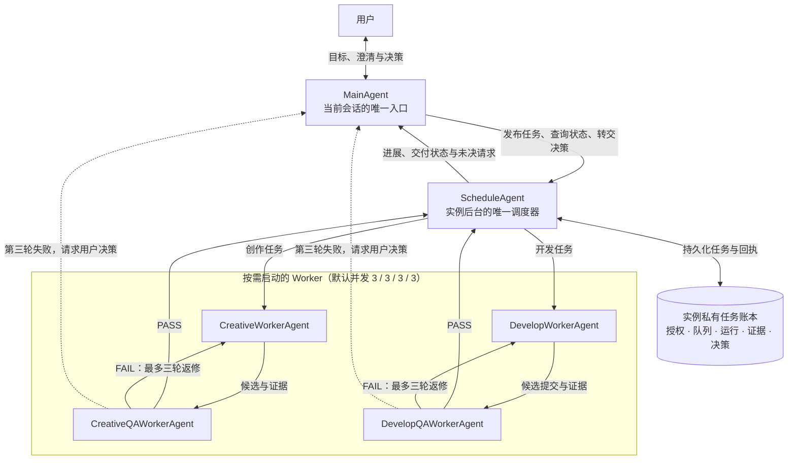

# 故事审阅台协作模式

本 Skill 是故事无关的软件能力。明确调用后，当前会话担任 MainAgent；后台 ScheduleAgent 管理同一项目实例的任务与四类 Worker。安装本 Skill 本身不启动进程、不发布任务、不授予创作或模型调用权限。

## 工作模式架构

Main 不直接占用 Worker；Schedule 根据任务依赖派发工作，并为候选派生独立 QA 与必要的返修。任务、授权、运行、证据和决策保存在当前实例的私有账本中，能力凭据只保存在实例私有运行目录。图中流程只有在用户显式激活模式并发布具体任务后才开始；安装 Skill 本身不会启动后台或取得任何执行权限。

## 接入

- 先读当前项目 README、AGENTS、STATE，确认显式项目根目录、实例位置及已发布指引。不得从父目录、邻近故事或 Skill 名称推断绑定。
- 使用本项目 `review-software/` 中的运行器。先执行 `node review-software/scripts/instance-skills.mjs verify --project PROJECT`，再按 [Main 入口](references/main.md) 接入。版本不一致时通过同一包的受管安装器更新；有本地改动时保留并报告冲突。
- 单例范围是一个项目实例：一个有效 Main、一个 Schedule；四类 Worker 默认并发分别为 `3/3/3/3`，按需启动。不同实例的队列、授权、决策和运行资格彼此独立。
- 当前会话负责与用户沟通。后台在入口关闭后继续推进；离线决策等待下次接入。新入口显式接管会使旧入口失去写权限。

## 按角色读取

| 当前角色 | 读取的协议 | 工作边界 |
| --- | --- | --- |
| MainAgent | [Main 入口](references/main.md) | 澄清、发布、查询及决策桥接 |
| ScheduleAgent | [任务调度](references/schedule.md) | 依赖、队列、质检闭环和用户请求 |
| CreativeWorkerAgent / CreativeQAWorkerAgent | [创作与创作质检](references/creative.md) | 当前故事的内容生产或独立验收 |
| DevelopWorkerAgent / DevelopQAWorkerAgent | [开发与开发质检](references/development.md) | 显式绑定的故事项目和通用软件开发或独立验收 |

各角色在发布或报告任务前读取 [任务与证据协议](references/protocol.md)。只加载本角色、当前任务及直接依赖的项目指引。

## 共同约束

- 普通问答由 Main 直接处理；具有交付目标的创作或开发工作才入队。v1 的用户任务及依赖由 Main 发布，Schedule 跟踪与调度，QA 和返修子任务由状态机派生。Main 不绕开 Schedule 占用 Worker，Worker 不自行创建未计入并发的 Agent。
- 任务发布授权来自当前项目的有效模式设置和本次请求。自动完成只覆盖记录的任务范围、生成、返修、质检及交付；其他故事、旧批次、正式采用或外部写入的权限不得由本 Skill 补造。
- Worker 根据任务选择可用模型及推理强度，以效果优先并记录实际配置。不预估成本或以余额检查阻止开工；实际额度、限流、认证及工具错误交由 Main 向用户报告。
- 质检独立检查精确产物，失败最多自动推进三轮；第三轮失败交由用户决策。工具阻塞、未观察或调用结果未知不算质量失败，结果未知先核对请求状态，不自动重发。
- 任务阻塞或持续积压时，展示四类运行／等待数量、原因和并发调整建议，由用户决定调整。并发 `0` 暂停该类新任务；缩容让在途任务安全收尾。
- Skill 源码只在通用软件仓库维护，项目副本由固定版本软件包安装。任务账本存放于本实例私有数据库；私有会话和能力凭据不进入 Skill、Git 或公开导出。
