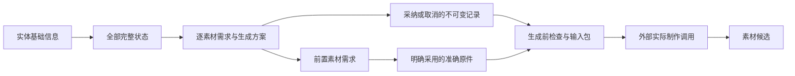

# 实体生成准备与统一审阅

实体采纳认可基础设定、直接关系、全部完整状态及已有素材方案。描述或方案尚未完整时也可采纳当前内容，生成前仍须完善并明确认可完整方案；准备完整的方案采纳允许 Codex 按依赖顺序准备生成。采纳不自动调用模型，不等于接受生成结果；新增候选和新评论不撤销方案采纳。实体、关系、状态、需求或显式参考方案换版后，当前方案重新待认可。

## 对象与数据流



沿用 ENTITY、STATE、REQUIREMENT、JUDGMENT、RELATION、CALL 和 ASSET。每份预期素材使用一个稳定 REQUIREMENT；`generation` 是该需求不可变修订内的生成方案。素材候选可以服务多个需求；复用需求以明确前置引用表示，不复制原件或冒充新调用。制作设定页只阅读、评论、采纳和取消，内容由 Codex 通过共用批量接口维护。

需求的既有 `scope,slot,entities,states,purpose,media_type,specification` 继续说明使用位置和输出要求。新增：

```json
{"generation":{"format":"generation-plan-v1","method":"generate","model":"明确模型 ID","parameters":{},"prompt":"完整实际提示词","inputs":[],"output":{"name":"素材名称","description":"具体产出与用途","review_criteria":["可核对的要求"]},"blockers":[]}}
```

`method` 为 `generate` 或 `reuse`。每项输入含 `reference:{object_id,revision_id}`、`use`，可引用准确 ASSET 及 `component_id,crop?,range?`，或引用准确 REQUIREMENT 的未来产出。后者必须先通过既有采用关系明确选定原件才可执行；不会自动取最新候选。复用方式必须引用同媒体类型的前置需求或文件。循环、错误类型、空的模型／提示词、缺少输出说明及无效参数结构被拒绝。方案可有明确的执行阻断（平台未核验等），这些不伪装成可执行状态。

ENTITY 和 STATE 可登记 `production_description`，表示供制作使用的完整描述；既有剧本事实和来源保留，新增造型／布局等是待用户采纳的制作选择。`production_blockers` 列出尚未解决且阻碍生成准备的问题，普通未知不自动阻断。未完善描述或素材方案时，实体聚合列出准确缺项，页面称为“生成前待完善”，不因此禁用内容采纳。

制作描述沿已有权威内容读取：显式 `production_description` 优先（明确空值仍为缺项）；完整状态使用其所属类型的全部非空 `dimensions`，旧基础描述使用 `blocks` 中的 `description`。标题、用途或剧情引文不替代制作描述，不要求作者再复制一份相同字段。真实缺项及 `production_blockers` 继续阻止生成准备通过，描述通过不转授采纳或原件选择。

整体状态参考可按实际职责声明 `usage=review_reference`，供独立全局审阅或可选比较。可选整体参考只允许用于 `reference_mode=description` 的状态；需要素材覆盖的状态仍要求匹配媒体类型的必需整体参考，局部参考不能替代。具体故事判断由实例作者维护，通用系统不根据关系数量自动撤回需求。

## 采纳、取消与并发

状态素材方案有两条替代许可路径：本方案版本的明确采纳，或所属实体有效且完整的整体生成许可；无需重复点击两次。实体自身需求仍独立审阅。两项决定独立取消，不改另一项已有决定。采纳方案没有真实结果时仍显示未生成；原件选择、生成结果审阅及实际采用各自成立。范围和历史理由由既有判断记录只读投影，不另建账本。

新模型 `entity-generation-v1` 的范围为 `{entity,relationships,states,requirements,dependencies}`，全部为准确修订。`dependencies` 递归锁定方案引用，未来原件的具体选择在执行输入中另存。生成结果不进入采纳范围。决策使用每个实体唯一的 JUDGMENT 身份，采纳和取消分别形成 `accepted`、`revoked` 新修订。取消指明被取消的决策；不得删除记录或通过更换判断 ID 绕过取消。

`POST /api/production/entity-decision` 与 CLI `production-entity-decide FILE` 接受 `{entity_id,action:accept|revoke,expected_version,scope,decision_ref?,acceptance_mode?,actor,reason}`。读接口给出当前 `decision_version`、`decision_scope` 和 `acceptance_mode`；写操作在既有原子导入事务中检查版本和范围。`content` 仅认可准确内容，`generation` 还要求准备完整；内容认可的具体语义与旧记录兼容见[素材卡与关系契约](materials-and-relationships.md)。重复或过期请求返回 409，不静默认可新内容。普通 judgment 导入同样执行校验，无绕过入口。

`GET /api/production/entity-review?entity_id=ID[&revision_id=SHA]` 返回现有实体、状态、媒体和评论，并增加 `requirements,preparation,decision_version,can_revoke`；`preparation` 含方案缺项及完整性。历史采纳通过准确决策修订读取冻结内容。旧 `entity-current-v1` 只表示过去的内容认可，不作为生成许可；可以携带 `revoke_target` 作为 `decision_ref` 取消，方案缺项不阻止取消。详见[素材卡与关系契约](materials-and-relationships.md)。

## 执行输入

`GET /api/production/generation-ready?requirement_id=ID`／CLI `production-generation-ready ID` 检查方案当前版本、单版明确采纳或所属状态的有效整体生成许可、前置原件的明确采用及完整性、范围和图像谱系。实际平台可用性及额度仍在调用前现场核对；工具不发起生成。

`GET /api/production/generation-package?requirement_id=ID` 返回准确执行清单；CLI `production-generation-package ID --output DIR` 写入空目录，包含清单和必要参考原件。阻断时拒绝输出可执行包。清单保留方案、决策、最终提示词和参数、参考的准确修订与 SHA-256；原件不得以平台链接替代。实际 CALL 可携带此清单中的 `generation_requirement`、`generation_acceptances` 和真实输入，提交时再次检查一致性；已发生的历史调用不改写。取消后已提交调用仍可登记实际产出，但其方案、采纳及执行输入必须与提交时相同；取消会阻止新的提交。

## 视频渠道、模式与输入角色

普通参考借鉴构图与身份；固定首帧或首尾帧要求渠道将图片用作端点。Prompt 写“以此图开始”不能改变上传角色。新视频方案使用 `generation.execution` 声明 `channel`、`mode` 与 `start_constraint`，每个直接输入使用 `role`。例如：

```json
{"execution":{"channel":"pippit-tool-cli","mode":"reference","start_constraint":"reference"},"parameters":{"duration":20,"resolution":"720p","aspect_ratio":"16:9","task_type":"reference"},"inputs":[{"reference":{"object_id":"exact-image","revision_id":"exact-revision"},"component_id":"original","role":"reference_image","use":"起始构图"}]}
```

`reference` 使用 `reference_image/reference_audio/reference_video`；`first_last_frame` 按顺序使用 `first_frame/last_frame`；`edit/extend` 的源视频为 `source_video`。`start_constraint` 分别为 `reference`（借鉴起始构图）、`fixed`（固定起点）或 `none`（未设计起点）。未知渠道、型号或模式保持待核实，不能因 Prompt、输入数量或能力开关单独正确就标为已验证。

`video_capabilities.json` 保存脱敏的只读渠道观察、CLI 版本和观察时间，`video_modes.py` 校验组合。当前 pippit-tool-cli 的 Seedance 首尾帧入口要求两张有序图片；2.5 配置还要求 adaptive 且禁止独立音频。2.0 Fast 未提供完整模式组合，不能继承 2.5 的限制或通过结论。单首帧路径尚无已核实入口。普通参考显式设置 `task_type=reference`，不同时设置 `generate_type=1`。配置变更需重新观察并更新契约；本地检查不证明账号权限、额度、服务接受请求或媒体效果。

计划检查可以在未选原件时核对模式、参数、角色与编号。`ready` 还要求适用的准确采纳许可、准确版本/候选、文件、组成、裁切或时间范围及原有谱系检查全部通过。准备包保留 `execution`、各输入的 `role`、`material_selection`、计划位置、逐媒体编号与原件哈希。新 CALL 必须保留相同渠道、模式、参数、顺序、准确候选、组成、角色和必要范围；选定信息也可沿冻结方案准确追溯。改选保留模式和角色，已提交方案变更进入新制作版本。旧 CALL 不补造模式或改写回执，后续状态登记也不得改变原执行输入。

## 阅读、评论和媒体

基础信息、状态、方案、素材分别在其标题旁切换真实修订；只有多个版本时提供选择器。历史内容可评论，但不得把混合版本采纳为当前方案。按钮旁的“整体采纳范围与理由”和“本版采纳范围与理由”提供准确内容、已有理由及折叠历史；各范围项链接到记录的准确修订。剧情依据直接链接到相关集场。

所有已支持评论的文字和图像区域使用一致的轻边线、评论图标和焦点反馈，选区后就近添加评论。不可评论的导航和说明不使用此样式。方案的描述、提示词、参数及参考说明投影为准确评论块，原有正文块和历史锚点不改写。

音频使用一个紧凑播放器：真实波形、播放头、时间选段和评论标记合并；拖动选段后可试听并评论，数值用于精调。时间保持原件坐标，限定在当前关联范围；解码失败保留时间轴，不伪造波形。已有音频不显示人物封面；共用大卡右侧一次展开一份素材，左侧素材小卡只在同卡切换。管理正文使用四列小卡及共用分页，窄屏仅重排当前页；缺失项仅在明确需求的位置按媒体类型占位，见[管理小卡契约](small-cards.md)。

## 迁移与验收

ASSET 可用 `candidate_requirements` 将候选明确对应到准确需求，要求同媒体类型、准确状态覆盖；这不回写 CALL，不表示按新方案生成或已经采用。参数评论使用服务端生成的准确文本，避免浏览器与 Python 对浮点数字表示不同而造成锚点偏移。

无需新表或破坏式迁移。旧对象和评论继续恢复；新增方案、准确依赖、采纳／取消修订及原件进入当前 Schema 9 导出。包含新方案评论的恢复必须使用支持该契约的系统。

验证覆盖：方案完整性、循环和错误输入拒绝、采纳／取消／重新采纳、结果不改变采纳、新方案必须重新认可、引用选择与范围、I2I 上限、并发拒绝、历史和恢复。浏览器必须操作文字／图像／音频评论、各区域版本、空素材和窄屏，并回归故事采编、结构、剧本及用户草稿。技术评论只写隔离实例。

未声明渠道约束的旧方案仍可阅读。需要按具体渠道核验的视频方案必须在准备前声明渠道、模式和输入角色，实际工具与准备依据一致后才能登记新调用。两处页面共用的素材卡、准确实际输入及关系契约见 [materials-and-relationships.md](materials-and-relationships.md)。


镜头视频的上游输入由本镜方案逐槽明确选定，校验与保存契约见[镜头制作](production-breakdown.md#镜头视频版本与准确参考)。它不使用全局采用或普通大卡默认候选补齐缺项；镜头方案仍需独立认可，完整参考不自动授予生成许可。历史实际输入、文件组成、裁切和时间范围保留。
