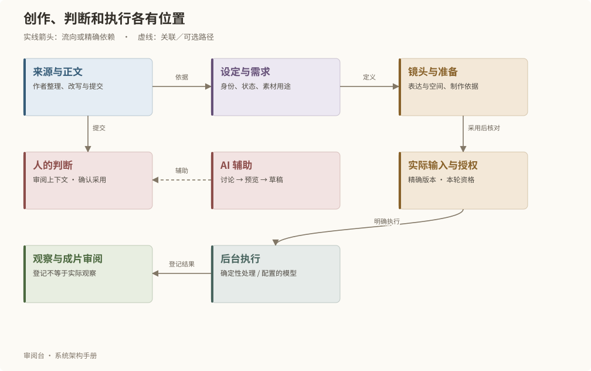
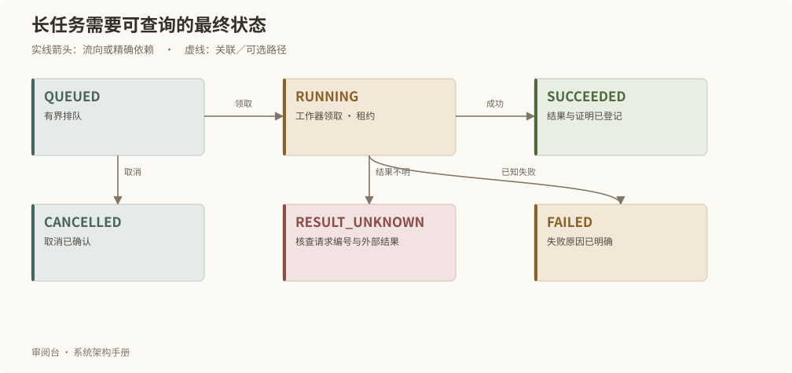

# 人与 AI 的完整协作流程

## 从来源到成片

创作沿三个相互连接的工作链推进：故事到剧本，剧本到素材，剧本与素材到全剧制作。来源、设定和制作之间允许反复核对；图中的顺序说明责任关系，不要求在开始写作前一次性确认全部设定。

以一场虚构的门口对话为例：先登记原始资料，写逐场正文，确认人物状态和素材需求；再准备空间和镜头，选择精确素材版本，完成输入锁定及本次授权，最后执行、观察、审阅和组装结果。每一步保留自己的版本和判断。

## 评论和助手如何协助判断

评论绑定永久对象、目标修订和正文锚点。修改或解决评论时保留原 target 与 anchor；历史评论不能自动搬到新稿同名段落。

助手的讨论模式生成意见；执行模式先产生修改前后预览。用户点击应用后，服务复核对象、来源与配置版本，只保存为草稿。正式采用、权利变化、实际输入锁定和生成仍要求各自明确动作。

助手读取对象、上下文、目录、原件时，实际读取的版本成为建议依据。原图读取核对素材版本和 SHA；音视频元数据不构成听音或看视频的证据。

## 单一工作器与长任务

| 状态 | 含义 |
| --- | --- |
| QUEUED | 已接受，等待有界工作器执行 |
| RUNNING | 工作器已领取并持有执行租约 |
| SUCCEEDED | 成功结果已登记，可查询证明 |
| FAILED | 已知失败，失败信息可查 |
| CANCELLED | 已确认取消 |
| RESULT_UNKNOWN | 无法确认外部执行最终结果，需要核查 |

队列上限 100，单工作器并发 1。失联执行不会自动重调外部模型。未采用 AI 建议正文保留 10 分钟；操作回执、已应用修订和未知结果不按这条短期保留规则删除。

## 适配器与制作能力

Codex 适配沿用宿主认证，凭据不进入故事包。外部制作命令必须显式配置，接收精确实际输入并把输出写入受管阶段。预演和制作清单可以由内置确定性程序生成，仍由工作器执行和登记。

## 制作审阅证据

预演、输入验收清单和单镜验收清单作为普通候选登记。制作审阅依据保存在 provenance 并随业务包往返；实际观察项不会自动勾选。

关键帧联合审阅绑定本镜的锁时、画面、叠加、边界和精确素材；单镜验收绑定当前视频与整场预演。实际输入、配方和排队执行会再次核对这些依据。修改其他镜头不会无差别废弃本镜。

## 项目 Codex 按反馈修稿

叙事拆解保留正文阅读、圈选评论、六项判断和审阅意见，不提供“编辑本稿”入口。通用草稿接口及其他创作页面继续保留。用户在项目 Codex 对话中指定永久集身份或清晰的意见范围后，Codex 才开始读取和准备修改；保存评论或提交审阅本身不会启动修稿。

1. `npm run review -- feedback EPISODE_ID` 读取本集全部已保存未关闭评论和最新审阅意见，CLI 自动完成分页且核对同一 contextHash。返回原对象、修订、圈选、来源及相邻集上下文。浏览器未提交草稿不属于已保存反馈。接口分页带 contextHash，期间变化则拒绝混合结果。
2. 逐项区分 CURRENT、HISTORICAL、ANCHOR_STALE。相同圈选的不同意见列出 potentialConflictWith，表示需人工核对的潜在冲突；系统不冒充已完成语义裁决。历史或锚点失效意见不能自动标为已处理，须保留原引用并说明未处理原因。
3. 准备预览请求：episodeId、contextHash、新 previewId、changes 和 responses。每项 changes 带 objectId、revisionId、expectedVersion、title、content；正文沿用 story-editing 的稳定段落及字段契约。每条反馈须唯一回应，含 feedbackId、outcome（ADDRESSED／DEFERRED／NEEDS_CLARIFICATION）、explanation、objectIds；潜在冲突被处理时另写已确认依据 conflictResolution。原文预览作为完整集场稿呈现，逐条回应独立于正文。
4. `npm run review -- feedback-preview --file -` 经标准事务保存 NOTE 预览，保留完整新稿、全部输入版本与逐条回应，尚不写入剧本。`feedback-result PREVIEW_ID` 回读完整预览，或用 `--revision` 读取精确历史。先向用户展示完整稿和独立回应，歧义、冲突或范围不明时澄清。
5. 用户明确应用该预览后，`feedback-apply --file -` 提交 previewId、revisionId、expectedVersion、explicit:true。服务在加锁后再次核对完整反馈、正文和预览；并发变化则拒绝陈旧写入，保留原预览。成功只产生新草稿，结果 NOTE 的精确依赖指向新稿修订，并保留输入修订。用 `feedback-result` 回查输出及回应；不自动采用、改变正式判断或关闭评论。

这套流程使用当前项目的 `/api/v1/workspaces/story-feedback` 读取和工作区事务，不另建模型队列。系统测试仅使用隔离数据和受控稿件。本次系统能力不授权处理真实创作意见或恢复旧创作批次。

## 实体评论与意见润色

主体档案与空间设定默认合并显示登记实体和已保存模块草稿，按永久实体身份去重；草稿中的删除提议仍保留原实体，显示待确认移除。来源属性与草稿、待审、采用状态分别标注，筛选不会改变判断。未定位地点有有效待确认位置 NOTE 时进入地图内的独立示意区，可打开原永久地点；没有当前提案时仍列为待核。两者都不推断地理坐标或代作正式采用。

实体卡中的意见可新增、编辑、关闭并查看关闭历史。对已登记实体，评论绑定其精确对象修订；对模块草稿中的候选，永久实体身份与承载该候选的 NOTE 草稿修订分别记录并显示，不将草稿载体伪装为已登记实体版本。后续确认设定不把旧评论换绑新稿，关闭历史仍能按原引用查阅。

实体意见润色沿用同一后台 comment-polish 工作流，输入必须包含用户已有意见、目标实体及精确修订、说明和必要关联上下文；同时有采用稿时单独标注。草稿原依据已变化时先重新核对，缺失内容如实说明。建议先预览，再由用户应用到评论草稿并明确提交；不修改实体、采用、权利或关闭状态。关闭卡片或切换后保留未提交意见及原润色操作编号，未知结果只查询原操作，不自动重复提交。

### 主体关系与素材阅读

故事设定以紧凑节点呈现全部当前登记主体及已保存候选。选中主体后高亮相邻主体和关系名称，可切换为只看相邻主体；画布坐标仅为展示几何，不写入实体或空间事实。登记主体、登记关系及页面级设定编辑入口已移除，API、review CLI、导入及项目 Codex 的版本保护写入继续保留。

实体详情内的局部图整合相邻实体、素材表现与关联需求。主体档案实体卡与空间卡以显式阅读属性默认展开“按列表浏览全部实体与关系”，仍可手动收起；其他画布保持原有展开行为。素材节点使用实际版本缩略图；音频仅标明类型，媒体缺失或预览读取失败明确显示。点击素材只展开卡内要求、状态和采用版本，不跳转页面；采用版本与待审版本不能混称。当前审阅参考直接显示来源引文与定位、依据标识、别名、逐条适用范围及当前／采用修订；永久身份、原始修订标识和 SHA 继续在折叠技术追溯中查询。实体评论继续绑定原修订，页面布局与筛选不改写业务数据。

### 素材整体审阅

素材版本、图片新用途和原图关系复核使用 `MATERIAL_OVERALL_V1`：标准只读，人工只选择整体结论并填写一栏说明；要求修改须填写非空说明，通过时可留空。不接收分项判断或三栏返修字段，不自动补 PASS，不提供新的禁止使用操作。原禁用、分项、返修及采用记录保持原样可读。此模式不用于故事或制作成果审阅；其原逐项校验继续生效。

素材关注重点按实际绑定的主体、状态、素材表现、需求、永久场及已采用项目规则组成，保留对象修订和 SHA。来源摘录与实际观察分开，无法唯一绑定的业务依据明确 UNKNOWN。历史版本只查冻结的需求与定义，不回填当前设定。关注重点 hash 与正式提交、AI 后台请求绑定；依据变化时保留用户整体说明，重新核对后再提交。AI 按标准组织只读观察，应用只填整体说明且不选择动作；素材管理不注册“结合这条意见问助手”的草稿目标，共用助手能力仍服务其他页面。

### 素材详情的打开与关闭

素材分类管理直接连接筛选、实体目录与素材详情，不展示“当前集场范围尚未归位的准备项”折叠区块。准备项和用途记录继续保留；真实的用途待核、依据失效与身份失配提示按原条件呈现。

目录选中的实体和详情弹层的打开意图分别保存。遮罩、关闭按钮与 Esc 统一写入明确关闭状态；切换基础素材与制作过程素材时保留实体和筛选，清除旧详情参数并保持关闭。用户主动打开或携带精确实体、素材族及版本的深链仍能定位原对象，浏览器前进后退按相应地址恢复。目录内查找条件也随浏览状态保留。

浏览器恢复焦点时重新校验目录，先保持同一实例最近一次完整读取与当前弹层可见，再整体接受新读取；不隐藏弹层父节点，不覆盖未提交输入，不让迟到响应恢复已关闭面板。实例身份变化时不得展示旧实例数据。草稿无法保存在浏览器时，三个关闭入口、详情历史导航和目录切换继续遵循未保存内容保护，取消离开即保留输入与弹层。制作过程素材详情同时返回其工作包绑定的实际制作步骤，供共享信息卡完成精确校验。未登记镜头审阅上下文时仍可查阅制作信息，明确显示 UNKNOWN 并关闭正式审阅，不用虚构标准补齐。
