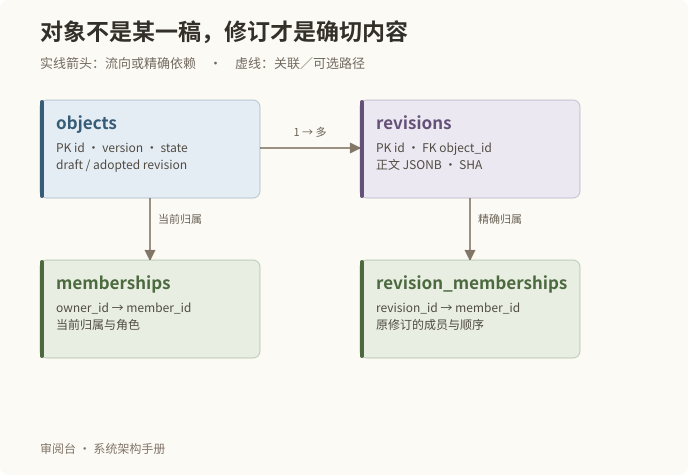
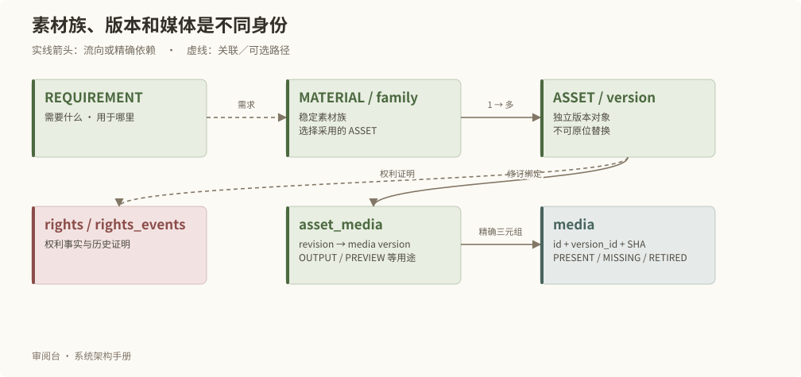
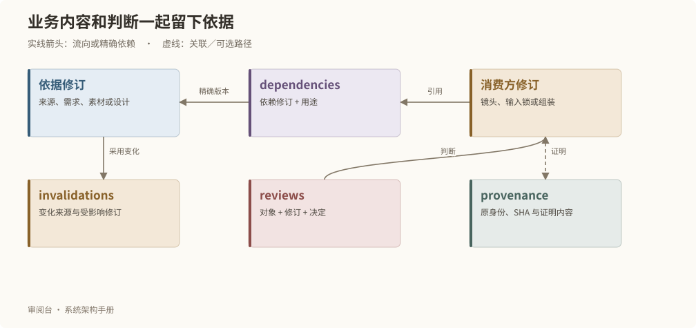

# 数据实体与关系

## 永久对象与不可变修订

objects 保存 id、领域、类型、标题、版本计数、状态、草稿头和采用头。revisions 保存不可变正文、内容 SHA、作者和修订号。两者通过对象身份与修订身份的组合约束对应，采用头不能指向另一个对象的修订。

version 用于并发核对；revisionId 标识一份确切内容；SHA 标识内容字节或规范化内容摘要。三个字段解决不同问题。显示场号或文件名不能替代其中任何一个。

## 故事与设定的组织关系

| 关系 | 存储 | 意义 |
| --- | --- | --- |
| 集包含场，且有顺序 | episode_scenes | 组织顺序与永久身份分开 |
| 实体之间的关系 | entity_relations | 两端为永久对象，关系本身也可修订 |
| 当前归属 | memberships | 为当前目录和组合提供查询 |
| 某个修订的归属 | revision_memberships | 保留历史版本当时的成员与顺序 |
| 原始资料 | source_documents | 原修订、原 SHA、MIME、字节和逻辑别名 |

对象自己的丰富结构放入 JSONB，例如正文块、镜头描述、时间线。归属、身份和跨对象版本引用由关系表保存并校验，不能全部塞进一个无法约束的整剧 JSON。

原始 SOURCE 正文不能覆盖；保存来源说明的新稿仍指向同一份原始资料。需要新原文时另行登记。来源存在多个版本时明确选择原修订，不按逻辑文件名猜测。

## 素材与实际制作输入

一个素材族可以包含多个 ASSET，采用指针选择其中一个版本。asset_media 把具体修订绑定到 media 的媒体身份、版本和 SHA，角色可以是输出、预览、来源或附件。

media 区分 PRESENT、MISSING 和 RETIRED。相同 SHA 可去重保存字节，但业务版本和用途不因此合并。rights 保存当前权利事实，rights_events 追加权利变化的历史证据。

## 精确依赖与审阅证据

dependencies 绑定消费方修订、依赖修订和用途：SOURCE、CONTENT、DEFINITION、DESIGN、ACTUAL_INPUT。invalidations 记录变化影响哪个消费修订。reviews 把判断绑定到对象及修订，provenance 保存原始身份、历史证明及制作审阅依据。

操作队列、建议、运行心跳分别存在 operations、suggestions、runtime_status。它们不是新的创作正文。操作队列不进入普通项目包；来源和必要历史则随包保留。

## 历史不会被显示编号重写

一个历史镜头如果基于旧稿的某一场，它继续引用原场身份和原修订。当前稿恰好出现相同显示场号，也不会自动成为这个镜头的新依据。实例册用精确依赖与普通关联两类线条帮助辨认这种区别。

逐表字段和约束见[附录](reference.md#generated-index)。
