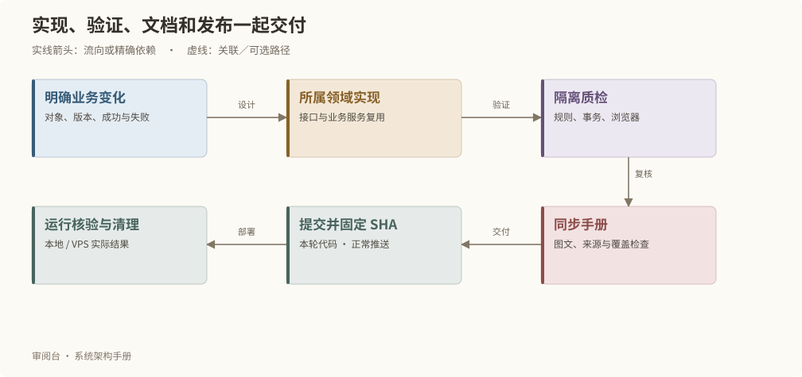

# 开发与质检流程

## 从业务问题到可交付能力



1. 明确触发动作、目标对象、精确版本、期望结果和失败语义。
2. 在核心仓库定位所属领域，复用业务服务与事务；项目副本只消费固定软件。
3. 先登记任务和阶段，再创建隔离实例、构建目录与测试资源。
4. 完成实现、必要回归、手册更新及运行验证。
5. 核对本轮变更，提交并推送；以已提交 SHA 发布，再核验实际运行和清理。

## 测试分层

| 层次 | 验证重点 | 代表性入口 |
| --- | --- | --- |
| 纯规则 | 契约、输入锁定、资源预算、部署参数 | tests/*.test.mjs |
| 数据事务 | CAS、幂等、回滚、历史不可变、精确失效 | object-store.test.mjs |
| 业务闭环 | 来源、评论、素材、制作、配置、恢复 | original-*.integration.mjs、maintenance.test.mjs |
| 浏览器 | 原版布局、编辑、导航、阅读状态与完整上下文 | original-*.ui.mjs、workspace-navigation.ui.mjs |
| 性能 | 冷首屏、模块切换、保存、持续使用 | original-cold-process.ui.mjs、ui-performance.mjs |
| 发布与恢复 | 固定 SHA、原操作续作、隔离数据库、实际服务 | deployment.test.mjs、systemd.test.mjs |
| 文档 | 链接、覆盖、图源、只读映射、阅读稳定性、独立运行 | handbook.test.mjs、handbook.ui.mjs、handbook-standalone.integration.mjs |

具体命令以当前 package.json 和测试入口为准。测试应覆盖可观察行为和真实风险；不为每个简单文案改动重复跑全部长时间验收。

## 受管执行

```bash
npm run process -- run --task my-change --phase contracts -- npm test
npm run process -- run --task my-change --phase types -- npm run test:types
npm run process -- run --task my-change --phase build -- npm run build
npm run cleanup:finish -- --task my-change
npm run cleanup:check -- --task my-change
npm run cleanup:complete -- --task my-change
```

例子中的任务名需换成这次任务的唯一标识。隔离测试使用自己的 PostgreSQL 和模拟模型，不对正式故事做隔离保存，不用真实付费生成证明系统链路。

## 手册如何伴随变化维护

通用正文、图源和覆盖索引在同一目录维护。每章记录实现来源、最近核验日期与 sourceDigest。修改引用的实现后，先复核说明，再刷新来源摘要；仅更新摘要不能代替人工判断。

- `docs:diagrams`：由声明式文本图源生成 SVG，无需在 VPS 安装浏览器或绘图服务。
- `docs:check`：检查引用、章节锚点、图源一致性、领域类型、数据库表和接口族覆盖；源内容变化时要求重新复核所属章节。
- `docs:build`：编译分章内容、目录与搜索索引，检查总产物预算，输出到受管构建目录。

构建和统一部署均执行手册检查。普通创作修改由实例册下次读取自动体现；只有概念、规则、流程和能力发生变化时才维护通用正文。旧文档入口保留链接，本目录是系统说明的正文维护来源。

独立运行测试直接调用 Next 构建，不提前执行文档命令，不额外复制手册目录；移开构建源目录并断开数据库后，仍须能读取全部章节和图表。这覆盖已安装部署器向新版本升级的构建入口。
