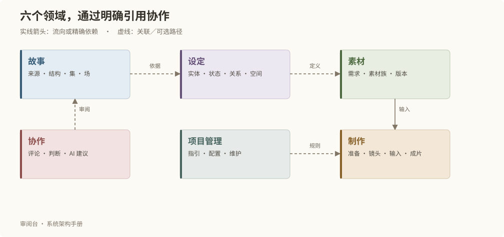

# 领域划分与职责

## 领域按责任划分

| 领域 | 拥有的核心对象 | 核心问题 |
| --- | --- | --- |
| 故事 story | SOURCE、STORY、EPISODE、SCENE | 依据是什么，故事如何组织，逐场如何表达？ |
| 设定 settings | ENTITY、STATE、REPRESENTATION、RELATION、SPACE | 谁或什么在什么状态，以什么形态参与故事？ |
| 素材 materials | REQUIREMENT、MATERIAL、ASSET、PROMPT、CALL、EXPECTED_OUTPUT | 需要什么，已有哪个版本，是否适用？ |
| 制作 production | PREPARATION、COVERAGE、SHOT_DESIGN、SHOT、INPUT_LOCK、ASSEMBLY、DELIVERABLE | 怎样呈现，实际使用什么，输出是否符合要求？ |
| 协作 collaboration | COMMENT、JUDGMENT，以及建议和对话服务 | 人和 AI 如何讨论、提出修改并留下依据？ |
| 项目 project | GUIDANCE、NOTE、配置、维护服务 | 实例规则、数据迁移和运行资格如何管理？ |

MATERIAL 表示素材族，ASSET 表示族内独立版本。STATE 是设定对象类型，不等于所有对象都有的 state 状态字段。完整类型索引见[附录](reference.md)。

主体类型不再提供 ORGANIZATION（组织）。默认配置、当前可选类型和保存校验保持一致；旧配置读取时不重新暴露退役类型，新配置与主体保存拒绝重新启用。既有永久身份、原修订及历史关系保留，实例已保存配置通过带版本核对的事务单独更新。旧快照允许原字节导入以保留恢复能力，但当前配置投影仍过滤退役类型，不恢复可选入口。

## 页面入口与领域不是一一对应

| 顶级入口 | 聚合的业务职责 |
| --- | --- |
| 当前工作 | 跨域工作链、阶段、失效提示与在途操作 |
| 故事创作 | 来源、结构、分集、逐场正文与评论 |
| 故事设定 | 主体、状态、形态、关系和空间 |
| 素材管理 | 需求、素材族、候选版本、权利与用途 |
| 全剧制作 | 准备、镜头、实际输入、预演、组装与交付 |
| 系统管理 | 规则配置、数据维护、运行信息、本手册 |

一个镜头详情可以同时展示故事依据、素材需求和审阅意见，但它不会因此拥有故事或素材的写规则。页面将动作交给所属服务，服务在事务内核对跨域引用。

## 用一项需求理解边界

“角色在雨中说一句话”可以产生故事正文、角色湿衣状态、声音或画面需求、一个镜头设计以及最终输入锁定。它们互相关联，却有不同的身份和审阅问题。采用正文不表示声音权利已经确认；采用镜头设计不代表执行模型生成。

新增能力时，先确定它回答哪个业务问题、拥有哪些对象和约束，再确定页面入口。不要为页面新增一套独立的业务存储。

## 制作设置与已生成素材

制作设置引用素材族、版本、修订和媒体 SHA，来源引用对象及修订。目录和文件名只用于导出命名，不补全业务关系。服务在保存事务中检查归属和精确引用，网页、CLI 与助手共用此规则。CALL 保存可继续编辑的制作设置；已有素材的采用状态、权利和媒体是独立事实，修改制作设置不改写已有产物的来源。
