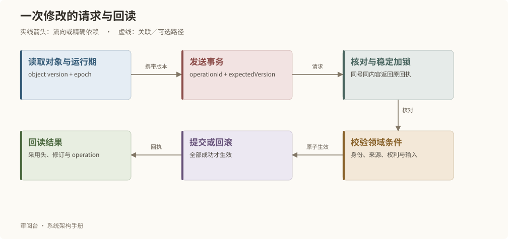

# 接口与一致性契约

## 接口按能力组织

| 方法与路径（/api/v1 下） | 用途 | 结果 |
| --- | --- | --- |
| GET health、work | 运行身份与跨域工作概览 | 状态与版本 |
| GET objects、objects/:id、contexts/:id | 分页目录、精确修订及上下文 | 对象、关系、basis |
| GET source/:revisionId、media/:sha | 原始资料与登记媒体 | 原字节；媒体支持 Range |
| GET facets、relationships、settings/spatial-baseline | 分类、关系与空间投影 | 有界读取 |
| GET workspaces/integrity | 当前对象、素材归属、制作设置和精确引用核验 | 问题对象及原因 |
| GET workspaces/... | 原版工作区读取投影 | 页面所需的一致上下文 |
| POST transactions | 保存、提交、判断及配置事务 | 操作回执和命令结果 |
| POST workspaces/... | 工作区动作 | 转换为所属对象服务命令 |
| POST jobs | 长任务入队 | operationId，之后查询 |
| GET operations/:id；POST operations/:id/cancel | 查询与取消 | 明确操作状态 |
| GET suggestions/:id；POST suggestions/:id/apply | 预览与应用 AI 建议 | 应用仅保存草稿 |
| GET assistant/conversations、assistant/events；POST assistant/... | 对话、只读上下文与事件 | 对话状态及建议 |
| GET export；POST import、upload | 项目包与媒体传输 | 流式内容或后台回执 |
| GET configurations、maintenance、review-library | 配置、维护与资源目录 | 各自当前状态 |
| GET documentation/catalog、documentation/chapters/:id、documentation/assets/:id | 通用手册 | 软件版本、正文、图表与内容哈希 |

完整接口族索引自动从路由实现提取；细分工作区动作以所属服务和测试为准，不能仅凭 GET 接口名称推测写入规则。

## 一次事务的请求



修改需要 operationId、expectedVersion 和从 health 取得的 x-review-runtime。operationId 标识一次意图；expectedVersion 针对对象当前计数；运行期用于阻止恢复前页面向新实例状态误写。

```json
{
  "operationId": "example-save-scene-001",
  "actor": {"kind": "HUMAN", "label": "示例作者"},
  "commands": [{
    "type": "save", "id": "scene-example", "kind": "SCENE",
    "expectedVersion": 3, "title": "门外的来客",
    "content": {"text": "门外响起脚步声。"},
    "links": [], "dependencies": []
  }]
}
```

这段是结构示例，不针对任何真实对象，也不应原样提交到创作实例。创建新对象的 expectedVersion 为 0；更新前必须读取实际版本和所属对象完整内容。

## 不同冲突分别处理

| 情况 | 系统行为 | 客户端动作 |
| --- | --- | --- |
| 同 operationId、同请求 | 返回原回执 | 查询或展示原结果 |
| 同 operationId、不同请求 | 拒绝 | 核对原意图，不能覆盖回执 |
| expectedVersion 已变化 | 拒绝整笔事务 | 重新读取并人工协调修改 |
| 运行期已变化 | 拒绝旧页面写入 | 刷新当前实例上下文 |
| 调用结果未知 | 保留原请求和核查依据 | 查询原操作，不自动再次调用 |

多对象事务按稳定顺序加锁，全部版本核对通过才生效。业务失败回滚，同时保留可查询的失败回执。传输失败本身不能证明服务器没有完成操作。

## CLI 与网页如何一致

review CLI 自动绑定实例运行期，调用相同 HTTP 接口。命令文件只是请求输入，不允许直接修改 PostgreSQL 或正式媒体。网页工作区同样经事务规划器落到所属业务服务；模型工具只能读取允许的上下文，建议应用再走正式事务。

常用入口为 `npm run review -- --help`，接口示例的来源版本和参数必须在实际执行前重新核对。

## 待确认空间位置接口

`GET workspaces/spatial-settings/placements` 返回当前依据、NOTE 版本与草稿头、待确认显示项及陈旧或冲突记录。`POST workspaces/spatial-settings/placements` 接收 `{action:"save", drafts:[...]}`；等价事务使用 `workspace.change` 和同名工作区。继续遵循本章的运行期与 operationId 契约。

每项 draft 提供 `noteId`、`expectedVersion`、`expectedDraftRevisionId`、`title` 和严格的 `content`。内容含永久地点与空间 SOURCE 的 id/revisionId/sha256/expectedVersion、独立的原始来源 `sourceSha256`、精确或 UNKNOWN 的场依据、`PENDING_CONFIRMATION` 状态、`CANVAS_ONLY` 槽位和待核说明。修订内容 SHA 与原始来源字节 SHA 不能互换，审阅元数据由服务放在提案正文之外。

每批 1–100 项，NOTE 与地点不得重复。规划器核对唯一有效采用 SOURCE，并在稳定加锁后重新核对全部依据、NOTE 草稿头与当前提案唯一性；SOURCE 目录变更也参与同一锁。失败整批回滚，成功只追加 NOTE 草稿。编辑不能换绑原依据。旧 NOTE 用 `objects/:id?revisionId=...` 精确回读；结果未知先查 `operations/:id`。
