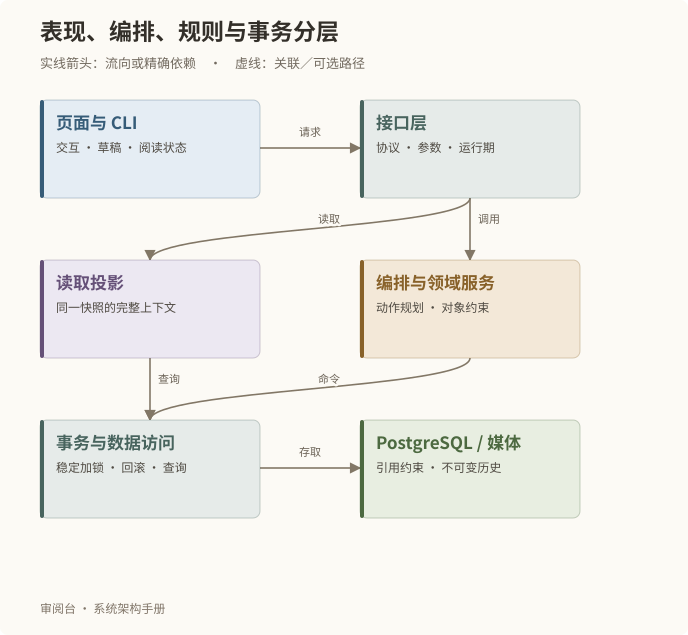

# 分层设计与页面读取

## 一次操作经过哪些层

| 层 | 主要职责 | 实现入口 |
| --- | --- | --- |
| 页面与客户端 | 交互、编辑草稿、导航、圈选和阅读状态 | web/app |
| HTTP 与 CLI 协议 | 解析请求、运行期检查、响应与错误 | server/api.mjs、scripts/review.mjs |
| 应用编排与业务服务 | 将工作区动作转换为对象命令，检查领域规则 | workspace-actions、commands、各域 service |
| 读取投影 | 组合页面需要的同版本上下文 | workspaces、presentation |
| 数据访问与事务 | 稳定加锁、读写、约束、回滚 | repository、db、schema |
| 后台执行 | 领取任务、调用受控适配器、登记结果 | jobs、worker、各域执行服务 |

这是模块化单体，六个领域不等于六个独立微服务。当前事务编排和数据访问有共享模块；架构图不会假装每个领域已经拥有物理隔离的仓储。接口之间不进行 HTTP 互调。

## 页面如何读到足够的上下文

正文、关联对象、精确输入、评论和已有判断在同一只读数据库快照中组合返回。basis 列出实际读取的对象版本和 SHA。普通关联可能展示当前稿，实际输入必须展示精确修订，两类绑定分别标注。

复杂工作区使用专用读取投影以保留原版交互。投影是请求结果，不是第二套业务数据库。分页需要同一读取版本，发现跨页变化就拒绝混合展示。

## 快速与稳定是两件事

浏览器与后端的业务读取缓存各最多 24 MiB，空闲 5 分钟淘汰。目录有界加载，详情按需读取。系统不缓存第二份整剧内容，SSE 不长期占用数据库事务，心跳不生成业务修订。

编辑中的草稿、筛选、阅读位置与圈选属于浏览器交互状态。后台轮询和读取缓存失效不得顺带清空它们；切回页面也不应把新响应造成的重排误当作用户主动定位。

## 手册自身的读取

本手册由 Markdown 编译成分章 HTML 与索引，图表为受管 SVG。通用文档接口在数据库连接前处理，只读发布包内清单允许的章节与资源，支持 ETag。文档总产物预算为 2 MiB；客户端复用现有读取缓存，单章按需加载。

实例册复用现有对象读取接口；它不会增加一条可以绕开业务校验的写路径。
