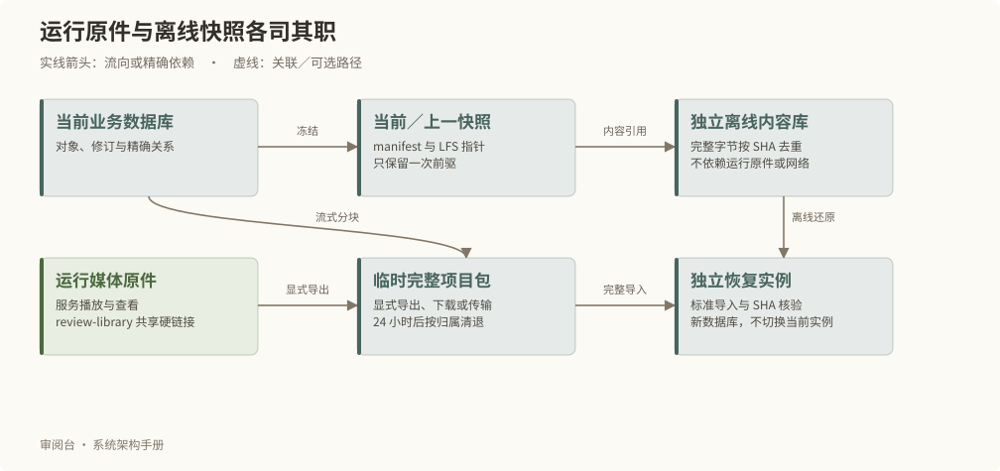
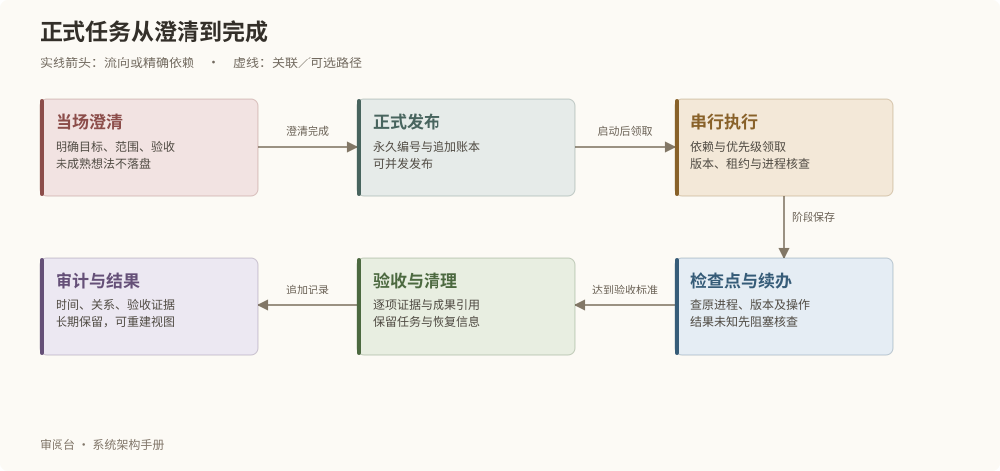

# 部署、数据与运行维护

## 创建和部署


```bash
# 在核心仓库创建空白故事
npm run project:create -- /新项目目录 --title 故事名
# 在故事项目部署
npm run deploy
npm run deploy -- --target local
npm run deploy -- --target vps-bj
npm run deploy -- --target all --dry-run
npm run deploy -- --status OPERATION_ID
npm run deploy -- --resume OPERATION_ID
```

默认发布本机核心仓库当前分支的已提交 HEAD，无需先 push。启动时固定完整 SHA，从 Git 内容建立干净构建目录；未提交和未跟踪修改不进入包。部署器不会自动 commit、pull、merge 或 push。`--source` 可以覆盖本次核心源码位置，路径不成为运行依赖。

all 先本地后 VPS；本地失败停止。SSH 不通报告 SKIPPED 并返回可区分的非成功码；已连接后的发布失败不能伪装为跳过。退出码 0 表示所选目标及清理全部成功，2 表示包含跳过，1 表示失败、结果未知或清理未完成。

## 宿主依赖与目标配置

需要 Node.js 22.13+、npm、Python 3、FFmpeg（含 ffprobe）、Docker；使用离线引用快照的项目还需要 Git 与 Git LFS。Linux 使用 systemd，macOS 使用 LaunchAgent。SSH 使用既有主机信任和 BatchMode。普通部署检查依赖，不安装系统软件或接管旧版非标准目录；反向代理及 TLS 由宿主管理。

```json
{
  "targets": {
    "vps-bj": {
      "sshHost": "vps-bj",
      "projectRoot": "/srv/story-review/my-story",
      "port": 3000,
      "listenHost": "127.0.0.1",
      "nodeBinary": "/usr/bin/node"
    }
  }
}
```

目标配置只存本机运行配置，不进入普通项目包。

## 从构建到实际切换

隔离构建验证版本、依赖与包完整性。本地切换前短暂停止新写入并等待在途任务；业务数据库保持原样。VPS 将冻结的本地业务包导入新的候选数据库，核验后切换演示基线。

实际服务核验软件 SHA、实例身份、数据库 Schema、后台工作器和媒体。未知操作阻断覆盖发布。使用 status 查询，resume 使用原编号、原提交及原业务输入；远端已成功并清理完成时，只补齐本机回执，不重新执行远端发布。

## 项目包与配置


版本 2 项目包由 manifest、模块分块 NDJSON、原始资料及 SHA 媒体构成，流式处理。单条记录上限 64 MiB，整体不要求装入内存。保留永久身份、草稿与采用头、关系、必要历史、未采用候选和正式证明。

导入仅允许空白独立实例，核对所有分块、原件和 PRESENT 媒体的字节 SHA；MISSING 和 RETIRED 保持原事实。素材附件、来源及使用位置还须通过与普通保存相同的对象、修订和 SHA 校验，任一失败回滚整笔导入。拒绝路径逃逸、符号链接、非空数据库或身份冲突。不恢复旧队列、会话和生成资格；导入产生新运行期，旧页面必须重新读取。

| 配置归属 | 例子 | 是否进入普通项目包 |
| --- | --- | --- |
| 系统 | 审阅标准、主体／素材类型、制作阶段、资源上限 | 是，独立 scope |
| 项目 | 标题、外观、画面基准、来源优先级、资源目录文本选择 | 是，独立 scope |
| 本机 | 数据库连接、端口、源仓库路径、宿主认证和执行命令 | 否 |

字段只有一个归属，不建立多层同名覆盖。具体合法字段由项目配置契约校验。

## 资源审阅目录

review-library 是便于人在文件管理器中阅读的只读投影。文件使用带正确扩展名的硬链接，与 SHA 媒体或显式选择的文本缓存共享同一文件内容，支持系统按扩展名选择打开应用；媒体不产生额外副本。项目根入口仍用相对软链，后台约每五秒检查已提交数据和文件指纹，完整构建并校验后原子切换；失败保留上一完整目录并报告 ERROR 或 STALE。

格式版本 2 自动替换旧的文件软链，保留原有业务路径与版本映射。目录与原件须位于支持硬链接的同一文件系统；不能建立硬链接时明确报错，不退回复制。索引记录生成时的文件身份，日常校验同时核对硬链接与原件的设备、inode 和内容 SHA；即使字节相同的独立副本也不被接受。清理旧目录只移除经过核验的文件入口，不删除仍由原件路径持有的内容。

目录用英文语义名、无声调拼音、真实版本和短身份后缀组织；未知归属放入 unclassified。候选、采用、历史、预览、缺失和退役在目录索引分别记录。可读文件名不是业务主键，也不是实际观察证明。

项目配置 reviewLibrary 包含 enabled 与 texts。每项文本显式指定 source 或 screenplay、永久 objectId、可选 revisionId 和 texts 下的相对 Markdown 路径。未固定修订时跟随当前内容，索引保存导出时的完整版本依据。原件和文本缓存只读，目录同步不改变业务正文。

```bash
npm run review -- library status
npm run review -- library list
npm run review -- library resolve review-library/images/分类/主体/文件.png
npm run review -- library sync
npm run review -- library verify
npm run review -- status OPERATION_ID
rg --files --hidden --no-ignore -L review-library
```

sync 和 verify 返回 operationId；必须查询成功回执。verify 强制核对全部 SHA。目录、缓存、机器路径和运行回执不进入普通业务包或 Git。

resolve 核验实际文件身份、与原件的硬链接关系和字节，返回精确媒体版本或文本来源依据及项目内 exactPath。工作器未运行时，目录保留最后一次同步结果，应先检查状态再判断是否为当前稿。

## 快照、完整项目包与恢复



“系统管理 → 数据与运行”提供保存恢复快照、导出完整包、导入和独立恢复。业务数据库仍是当前权威；快照是一次冻结的可恢复状态，不参与网页日常读取。

| 保存位置 | 内容与用途 | 保留方式 |
| --- | --- | --- |
| instance/media | 按 SHA 登记的运行原件 | 当前作品及有效版本闭包 |
| project-data/current | 当前 manifest、数据块／媒体／来源的 LFS 指针 | 每次成功保存替换 |
| project-data/previous | 紧邻当前的一次恢复快照 | 下一次成功保存时轮换 |
| project-data/baseline | 初始化或迁移登记的可选冻结起点，只存引用 | 普通保存不轮换；通过基线编号独立恢复 |
| .git/lfs/objects | 独立的完整内容库 | 离线恢复已保留快照和基线；不能与运行原件硬链接 |
| 受管导出目录 | 自包含 tar 完整包 | 明确导出才产生，成功后保留 24 小时 |
| review-library | 人可阅读的媒体入口 | 与运行原件硬链接，共享字节 |

快照工作文件保持指针，关闭自动 smudge，避免检出后再次展开完整媒体。写入 LFS 时使用真实输入文件作为文件参数，不能用已存在的短指针目标提供输入尺寸。离线核验逐一检查指针、大小与内容库 SHA，不下载网络对象，也不依赖运行原件。项目只使用自己的独立 `.git/lfs/objects`；自定义共享 LFS 存储和仓库外路径不能用作这个恢复库。

后台工作器先生成并核验快照，取得独占锁后切换 current／previous。失败保留原快照；切换结果未知时保留恢复输入和原操作编号，阻断新保存，先核查原操作。完整下载包只有显式导出或导入时产生，清退到期归档前核对操作、阶段和占用，不清理未知任务。需要长期保留完整包时，将下载文件存放到用户自行管理的位置。

恢复使用当前／上一快照、已登记基线或未过期完整包编号，在受管新目录建立独立 PostgreSQL 和软件副本；当前实例不切换，也不启动真实模型任务。快照先从离线库展开到恢复阶段，再通过标准导入校验；阶段结束清除临时展开内容。

普通部署保留当前与上一软件／数据库恢复点。更旧资源必须确认活动指针、身份、SHA 和占用后清理。用户明确保留的备份与独立恢复副本不按普通日志期限删除。封存旧项目备份不被自动读取、扫描或删除。

```bash
npm run review -- snapshot save
npm run review -- snapshot verify
npm run review -- snapshot status
npm run review -- snapshot export
npm run review -- snapshot restore --file restore.json
npm run review -- status OPERATION_ID
```

save、export、restore 与网页共用后台维护接口；verify 是不写数据的离线核验。`review maintenance verify` 另核对运行数据库、关联与原件。恢复请求包含 backupId、targetName 与 explicit:true。恢复结果给出独立目录；新副本不会自动启动 Web，可从该目录使用正常部署入口上线。

## 正式任务管理

项目 Codex 使用 `$review-tasks` 讨论、发布、执行、续办和审计正式任务。主会话维护协调运行和账本，网页及业务工作器不自动执行此队列。任务管理可在网页停机时使用；故事对象与创作结果仍通过原业务 API 保存。调度不依赖 Ultra 开关，主 Agent 保持用户选定模型与强度。



### 讨论与批量发布

发布默认先讨论目标、范围、交付物、验收、可行性和授权，用户认可讨论结论后立即正式入案，不再重复确认。本轮已经认可的结论直接沿用。未澄清想法不生成编号、文件、草稿或事件，也不跨会话恢复；正式任务遇到障碍则记录阻塞，不能丢弃。

一次输入可以按目标、依赖和修改范围拆成多项任务或合并相关问题，不固定一次一个。每项保存原始请求、discussion.summary、feasibility、approvedRequirements 和明确授权，避免拆分遗漏。未知可行性可以成为用户认可的独立调查任务。SYSTEM 先维护通用核心并验证项目继承，CREATIVE 只在所属故事项目内按精确授权推进。

`publish` 支持单个 task 或 tasks 数组（每批 1–50 项，可分批处理更多问题），每项须 clarified 和 discussion.approved 为 true。批内 key 唯一，用 `@key` 引用同批依赖，已有任务用正式 ID。全部校验通过后一次追加事件，任何一项未讨论、依赖不存在或形成循环时整批不发布；未成熟部分应在讨论阶段排除。

### 发布后的本地管理提交

Codex 在发布成功后先 `audit --operation-id 原发布编号 --format markdown` 回读，再自行调用 `commit --file -`，输入 `{operationId,actor,publishOperationId}`。不要求任务为 RUNNING 或存在执行租约，不重复请求授权。该流程只创建本地 Git 提交；publish 本身保持入队语义，其他状态变化也不自动提交。推送仍遵循独立交付授权。

提交入口在当前项目仓库内锁定账本，验证项目绑定、事件哈希与连续版本链、完整未提交前序、确定性阅读视图及 HEAD 中的历史前缀。清单只包含 `tasks/project.json`、实际事件文件、`tasks/README.md` 和实际任务对应的 `tasks/items/编号.md`；未知卡片、artifacts、故事、源码和 runtime 不自动纳入。视图的截至时间固定为最后事件时间，rebuild 不制造空变更；视图被手改或缺失时先核查并重建。

使用标准 `index.lock` 排斥常规 Git 写入，在独立 index 中从 HEAD 构建并核查精确提交树，通过 `commit-tree` 和父提交 CAS 更新分支，再仅更新原暂存区中的受管条目。无关文件内容和暂存条目保留，不执行 checkout、reset、stash、hooks、filters 或 push。需已有本地分支及初始提交；未完成合并／变基、split index、未知锁、受管文件不同暂存内容或父仓库路径均拒绝并保留现场。

管理提交回执仅存 runtime，记录原操作、发布编号、账本序号和头摘要、提交 SHA、精确清单及 index 恢复指纹。返回 SUCCEEDED / NO_CHANGES 时可报告实际 SHA；失败不撤销发布。中断先 `commit-status --operation-id 原管理提交编号` 核查原提交是否进入历史和 index 是否完成，再重放相同请求：只有分支和 index／锁指纹能共同证明范围才恢复，否则保留现场。相同请求返回原结果，后来事件须新管理提交；同内容不造空提交。并发发布与提交共用账本锁，后发事件保留待提交事实，执行资格与业务对象不受影响。

### 账本、版本与运行资格

`tasks/project.json` 绑定故事实例及协议版本。v2 CLI 可回放 v1/v2 事件；已有 v1 账本须在没有活跃执行者、命令和未关闭派工时显式 upgrade。旧事件及编号不改写，旧 CLI 读取 v2 绑定即拒绝，不能降级写入。新项目直接使用 v2。

`tasks/events` 是追加式 JSON 事务账本，包含操作编号、请求指纹、操作者、时间、前序摘要和完整任务版本。发布、批量发布、调度、合并、拆解和父项汇总均原子生效。写入短暂独占锁并校验 expectedVersions；同号同请求返回原结果，不同请求拒绝。任务编号、正式 title、原话及已认可范围在原案中长期稳定，改目标须讨论并新建任务。

`tasks/README.md` 与 `tasks/items` 是可重建阅读视图，审计从事件回放读取事实。任务和派工的逻辑编号、选择理由、状态、检查点、原操作编号、成果和验收/关闭证据随私库保存。机器路径、原生线程 ID、socket、PID、租约及派工绑定只在 `instance/runtime/task-execution`，不进入公开软件或业务导入包；复制数据不恢复执行资格。

日常 `tasks list` 默认只列 READY、RUNNING、BLOCKED、WAITING_REVIEW。明确指定 `--all` 才纳入 DONE、CANCELLED、MERGED；状态、类别、任务筛选与该范围取交集，所以 `list --status DONE` 为空，而 `list --all --status DONE` 返回匹配的完成历史。JSON 与 Markdown 共用同一集合、发布时间排序和固定七列；空 Markdown 列表仍显示表头和 0 项。此默认范围只影响 list，show、status、audit 及完整历史阅读视图保持原语义。

每个项目只有一个 `run` 协调运行，10 分钟租约，阶段间 heartbeat，guard 内自动续租。旧协调进程仍活跃时不接管。协调进程死去而原命令仍运行时，仅在原命令具有可核验派工及完整资源占用时允许新协调者推进无关任务；未知归属或旧串行命令仍阻断接管。运行身份不能复用。

### 调度与资源占用

主 Agent 准备 schedule 候选，包含所属正式任务、稳定派工 key、目标、交付物、验收、资源、模型选择理由、前置派工以及重派时的 attemptOf。调度事务按正式依赖、优先级（0 最高，默认 2）、发布时间、编号检查候选，原子保留可执行派工，返回其余项目的等待原因。同一正式任务可有多个独立派工，跨任务同样可以并行；派工本身不必再成为正式任务。

| 资源 | 规则 |
| --- | --- |
| FILE / DIRECTORY | 使用 core/...、project/... 逻辑路径；写入与同文件、重叠目录的访问互斥 |
| OBJECT | 使用永久对象身份；写入与同对象访问互斥 |
| READ | 必须提供精确不可变版本，可与其他不可变读取并行 |
| UNKNOWN | 无法确认范围，独占全部派工资源 |

路径大小写按保守冲突处理，拒绝绝对路径、父目录跳转及非规范别名。资源占用持续到派工 CLOSED；交回或空闲不能释放占用。阻塞且命令已结束的主 Agent 派工保留受影响资源，无关资源可以继续。代码派工使用独立受管 Git worktree；原生线程启动回执保存到 runtime，再开始工作。

每项派工依次记录 RESERVED、dispatch 尝试、RUNNING、DELIVERED、ACCEPTED、CLOSED，遇到中断可进入 BLOCKED。先 schedule 和 assignment dispatch，再调用原生 spawn；缺失回复先 reconcile 原调用，禁止盲目重发。一次 Agent 只绑定一项派工，负责人和辅助 Agent 分别登记，主 Agent 统一控制容量。已关闭派工不再改动；重派创建新编号及新 Agent。

`guard --assignment ID` 使用派工独立命令锁和进程记录，允许无冲突命令并行；开始命令时在账本锁内重新核查状态。共享核心整合、正式业务保存、提交推送和部署由主 Agent 串行完成，共享核心命令加 `--core` 锁定真实 Git common directory。guard 不代替业务 CAS，也不约束绕过协议的其他会话。旧 `next` 保留串行兼容，有未收敛派工时不跨过它领取新任务。

### 模型、Goal 与 Agent 关闭

| 工作 | 默认模型 | 强度 |
| --- | --- | --- |
| 明确查找、机械整理 | gpt-5.6-luna | medium |
| 多文件探索、研究 | gpt-5.6-terra | high |
| 普通实现、测试、修复 | gpt-5.6-sol | xhigh |
| 架构、高风险、争议核验 | gpt-6-astra | max |

选择必须属于本次原生 model/list 支持的模型和强度，并保存理由；升级和返工通过新派工保留选择历史。并发容量以本次宿主可用槽位为准，已交回但尚未关闭的 Agent 仍计入占用。原生工具最终执行 spawn，CLI 本身不另开模型守护进程。

`native probe` 只连接已有 Codex App Server，先确认当前父线程映射，再在受管目录创建空探测线程、归档并回读。只有从 loaded/list 消失且 thread/read 为 notLoaded，并保留历史时才认为关闭得到验证。连接、父线程映射、API 或关闭回读失败均降级主 Agent；不能把 idle、interrupt 或单一 archive 成功回执当销毁。探测回执只在当前本机运行有效。

长派工的 Goal 目标是交回可验收结果，短辅助工作可不用 Goal。原生 Goal 在隔离子派工实测后启用：verify-goal 检查独立线程及活动 Goal，观察不发送 turn/followup 时出现新轮次，随后由父端暂停并回读，核查父 Goal 目标、状态和预算没有改变。观察失败也暂停探测 Goal；不能仅用两个旧轮次、提示文本中的 /goal 或账户开启 goals 作为证明。未验证时长派工使用 FOLLOWUP，仅在同一未完成派工内继续。

交回结果先 assignment result，再由主 Agent accept。Agent 完成、取消或替换后先持久保存结果/检查点，再 native close：暂停 Goal、停止活动 turn、精确停止其后台命令、归档及核查卸载，保留聊天历史；不调用 thread/delete。最后 assignment close 保存关闭和清理证据。所有相关 Agent 都要关闭，后续派工重新启动，不能建立空闲 Agent 池。

关闭失败或原调用未知时保留派工占用和恢复输入；已确认未创建 Agent 的失败调用可以用 reconcile 记录 noAgentCreated 和原调用证据，再关闭派工。正式任务不能因为某个子 Goal 完成就自动 DONE。

### 检查点、恢复与完成

检查点保存已完成步骤、下一步、精确输入、成果与原操作编号。外部操作先登记 PENDING，执行后保存结果；RESULT_UNKNOWN 只查询原操作，不重复调用。新检查点不能遗失既有操作编号，有未核查操作不能关闭派工或完成任务。

跨会话恢复先核查旧协调进程、Agent、命令、工作区、版本和原操作，再 assignment reconcile。原生身份可补记原回执，不能换绑为新线程；原线程父身份在 runtime 保留，供新会话按原归属关闭。核查及关闭旧派工后，以新派工、新 Agent 继续；旧串行任务仍支持 resume。用户停止时先停止新派工、保存状态，收敛 Goal/Agent/命令，再 stop；停止请求后仅允许检查点、结果及关闭等收尾写入。

| 正式状态 | 含义 |
| --- | --- |
| READY | 正式发布，等待依赖满足和调度 |
| RUNNING | 当前或待恢复运行已经领取任务 |
| BLOCKED | 已记录障碍，或等待拆解子任务 |
| WAITING_REVIEW | 已执行并收敛派工，等待约定验收 |
| DONE | 逐项验收有证据、全部派工关闭、清理已记录 |
| CANCELLED | 明确取消，保留原案 |
| MERGED | 合并到另一正式任务，保留原案和指向 |

合并仅处理同类未开始任务，继承全部原范围、授权、交付物与逐项验收。拆解覆盖原验收项，子项继承依赖，全部完成后父项汇总完成；依赖合并原案时沿目标核查完成。完成结果保存逐项证据、成果引用及清理证明。SYSTEM 分别核实测试、核心与私库推送、项目继承、本地和可达 VPS；CREATIVE 的 DONE 不代替故事正式采用。

父任务完成 cleanup:finish、cleanup:check、cleanup:complete 后再标 DONE；Agent 关闭不等于 worktree 可删除，成果整合或恢复引用未解除时保留资源。最终任务事件可在收尾提交保存，不自引用其提交 SHA。

### 稳定审计契约

用户可见列表始终使用下列七列，不按内容或查询次数增删、换序。标题原样取正式 title，不缩写或临时概括；依赖使用完整任务编号链接，无依赖写“—”。

| 任务编号 | 任务标题 | 类别 | 状态 | 优先级 | 发布时间 | 前置依赖 |
| --- | --- | --- | --- | --- | --- | --- |
| 原案永久 ID | 原案正式 title | 系统优化（SYSTEM）/ 内容创作（CREATIVE） | 中文及原码 | 0–3 | 北京时间完整日期与秒 | 原案依赖 ID |

一行说明截至时间、范围、数量和状态分布；默认发布时间升序，编号打破平局，用户明确指定才改变排序。时间统一 Asia/Shanghai 的 YYYY-MM-DD HH:mm:ss，不改用今日或相对时间。进展、完成时间、阻塞、成果用附表；执行概况用“项目｜当前情况”，详情用“字段｜内容”，派工审计另表展示模型/强度、Goal、关闭情况。未发生写“—”，无法核验写 UNKNOWN，空列表仍显示表头和 0 项，不虚构百分比。

list / status / audit / show 的 `--format json|markdown` 默认 JSON 保持接口兼容；Skill 面向用户必须采用 Markdown 共享渲染器，任务 README 使用同一渲染器。audit 返回当前任务事实及事件时间窗口，from 包含、to 不包含；窗口限定事件，不伪装历史时点快照。

```bash
npm run tasks -- help
npm run tasks -- list --format markdown
npm run tasks -- status --format markdown
npm run tasks -- audit --task TASK_ID --format markdown --columns progress,completed
npm run tasks -- show TASK_ID --format markdown
npm run tasks -- audit --operation-id OPERATION_ID
npm run tasks -- rebuild
```

发布和修改通过 `--file -` 接收 JSON，避免保存临时请求文件，完整字段契约以 help 为准。Skill 模板和 CLI 只在核心维护，部署安装至项目 `.agents/skills/review-tasks`，核查 SHA 并拒绝覆盖未知本地修改。`tasks install` 可重做安装，rebuild 可重建视图。
## 过程资源与宿主配置

阶段资源先登记精确归属，跨阶段交接给具名消费者；正式资源 retain 具体用途。阶段成功、失败、取消都要收尾，父任务运行 finish、check、complete；空清单同样检查项目镜像，不进行全局 prune。

执行器保存 PID 与出生时间、路径的设备／inode，以及 Docker ID 和任务标签。未知路径、符号链接、Git 工作或其他运行占用阻断清理。异常退出由服务监督器每五分钟有界补清，不按时间猜测具名交接已经失效。

跨阶段输出在阶段 scratch 之外预先登记并 transfer，消费者结束后 release。正式运行包和数据库先 retain 再切换指针，写明用途及恢复证明。process run 自动建立父任务；所有阶段结束后明确 finish，已结束任务不复用。额外资源必须先由所属执行器精确登记；cleanup:complete 的可选 --manifest 仅接受同一任务的空清单，不接管任意目标。任何主机状态未知或消费者未释放都不能报告清理完成。

日志最多七天且不超过 100 MiB。未知执行结果保留恢复输入，不按普通日志清除。临时资源默认上限 64 GiB，并保留至少 8 GiB 可用空间。

本机 assistant 配置指向宿主 Codex 与 Python 可执行程序，沿用宿主登录；外部 production.command 是显式的命令参数数组，输入通过 JSON 标准输入传入，输出必须位于受管阶段。配置和凭据不因文档阅读而改变。
