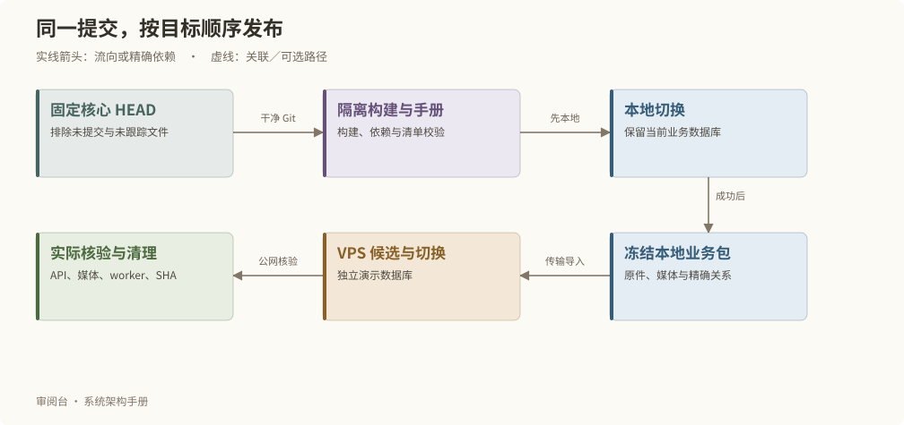
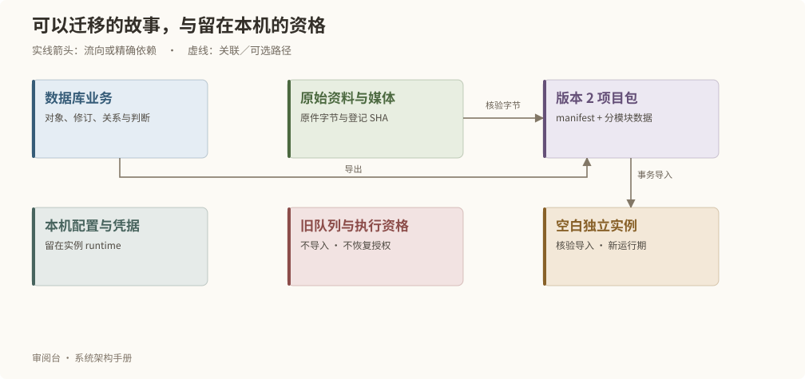

# 部署、数据与运行维护

## 创建和部署



```bash
# 在核心仓库创建空白故事
npm run project:create -- /新项目目录 --title 故事名
# 在故事项目部署
npm run deploy
npm run deploy -- --target local
npm run deploy -- --target vps-bj
npm run deploy -- --target all --dry-run
npm run deploy -- --status OPERATION_ID
npm run deploy -- --resume OPERATION_ID
```

默认发布本机核心仓库当前分支的已提交 HEAD，无需先 push。启动时固定完整 SHA，从 Git 内容建立干净构建目录；未提交和未跟踪修改不进入包。部署器不会自动 commit、pull、merge 或 push。`--source` 可以覆盖本次核心源码位置，路径不成为运行依赖。

all 先本地后 VPS；本地失败停止。SSH 不通报告 SKIPPED 并返回可区分的非成功码；已连接后的发布失败不能伪装为跳过。退出码 0 表示所选目标及清理全部成功，2 表示包含跳过，1 表示失败、结果未知或清理未完成。

## 宿主依赖与目标配置

需要 Node.js 22.13+、npm、Python 3、FFmpeg（含 ffprobe）、Docker；Linux 使用 systemd，macOS 使用 LaunchAgent。SSH 使用既有主机信任和 BatchMode。普通部署检查依赖，不安装系统软件或接管旧版非标准目录；反向代理及 TLS 由宿主管理。

```json
{
  "targets": {
    "vps-bj": {
      "sshHost": "vps-bj",
      "projectRoot": "/srv/story-review/my-story",
      "port": 3000,
      "listenHost": "127.0.0.1",
      "nodeBinary": "/usr/bin/node"
    }
  }
}
```

目标配置只存本机运行配置，不进入普通项目包。

## 从构建到实际切换

隔离构建验证版本、依赖与包完整性。本地切换前短暂停止新写入并等待在途任务；业务数据库保持原样。VPS 将冻结的本地业务包导入新的候选数据库，核验后切换演示基线。

实际服务核验软件 SHA、实例身份、数据库 Schema、后台工作器和媒体。未知操作阻断覆盖发布。使用 status 查询，resume 使用原编号、原提交及原业务输入；远端已成功并清理完成时，只补齐本机回执，不重新执行远端发布。

## 项目包与配置



版本 2 项目包由 manifest、模块分块 NDJSON、原始资料及 SHA 媒体构成，流式处理。单条记录上限 64 MiB，整体不要求装入内存。保留永久身份、草稿与采用头、关系、必要历史、未采用候选和正式证明。

导入仅允许空白独立实例，核对所有分块、原件和 PRESENT 媒体的字节 SHA；MISSING 和 RETIRED 保持原事实。拒绝路径逃逸、符号链接、非空数据库或身份冲突。不恢复旧队列、会话和生成资格；导入产生新运行期，旧页面必须重新读取。

| 配置归属 | 例子 | 是否进入普通项目包 |
| --- | --- | --- |
| 系统 | 审阅标准、主体／素材类型、制作阶段、资源上限 | 是，独立 scope |
| 项目 | 标题、外观、画面基准、来源优先级、资源目录文本选择 | 是，独立 scope |
| 本机 | 数据库连接、端口、源仓库路径、宿主认证和执行命令 | 否 |

字段只有一个归属，不建立多层同名覆盖。具体合法字段由项目配置契约校验。

## 资源审阅目录

review-library 是便于人在文件管理器中阅读的只读投影，通过相对软链关联 SHA 媒体与显式选择的文本。后台约每五秒检查已提交数据和文件指纹，完整构建并校验后原子切换；失败保留上一完整目录并报告 ERROR 或 STALE。

目录用英文语义名、无声调拼音、真实版本和短身份后缀组织；未知归属放入 unclassified。候选、采用、历史、预览、缺失和退役在目录索引分别记录。可读文件名不是业务主键，也不是实际观察证明。

项目配置 reviewLibrary 包含 enabled 与 texts。每项文本显式指定 source 或 screenplay、永久 objectId、可选 revisionId 和 texts 下的相对 Markdown 路径。未固定修订时跟随当前内容，索引保存导出时的完整版本依据。原件和文本缓存只读，目录同步不改变业务正文。

```bash
npm run review -- library status
npm run review -- library list
npm run review -- library resolve review-library/images/分类/主体/文件.png
npm run review -- library sync
npm run review -- library verify
npm run review -- status OPERATION_ID
rg --files --hidden --no-ignore -L review-library
```

sync 和 verify 返回 operationId；必须查询成功回执。verify 强制核对全部 SHA。目录、缓存、机器路径和运行回执不进入普通业务包或 Git。

resolve 核验实际链接和字节，返回精确媒体版本或文本来源依据及项目内 exactPath。工作器未运行时，目录保留最后一次同步结果，应先检查状态再判断是否为当前稿。

## 备份与恢复

“系统管理 → 数据与运行”提供核验、备份、导入和独立恢复。后台核验完整包后才提供下载。恢复只使用本实例已核验备份编号，在受管新目录建立独立 PostgreSQL 和软件副本；当前实例不切换，也不启动真实模型任务。

普通部署保留当前与上一软件／数据库恢复点。更旧资源必须确认活动指针、身份、SHA 和占用后清理。用户明确保留的备份与独立恢复副本不按普通日志期限删除。封存旧项目备份不被自动读取、扫描或删除。

CLI 对应 `review maintenance verify`、`review maintenance backup`、`review maintenance restore --file restore.json`；恢复请求包含已核验的 backupId、targetName 与 explicit:true。恢复结果给出独立目录；新副本不会自动启动 Web，可从该目录使用正常部署入口上线。

## 过程资源与宿主配置

阶段资源先登记精确归属，跨阶段交接给具名消费者；正式资源 retain 具体用途。阶段成功、失败、取消都要收尾，父任务运行 finish、check、complete；空清单同样检查项目镜像，不进行全局 prune。

执行器保存 PID 与出生时间、路径的设备／inode，以及 Docker ID 和任务标签。未知路径、符号链接、Git 工作或其他运行占用阻断清理。异常退出由服务监督器每五分钟有界补清，不按时间猜测具名交接已经失效。

跨阶段输出在阶段 scratch 之外预先登记并 transfer，消费者结束后 release。正式运行包和数据库先 retain 再切换指针，写明用途及恢复证明。process run 自动建立父任务；所有阶段结束后明确 finish，已结束任务不复用。额外精确清单通过 cleanup:complete 的 --manifest 参数传入，任何主机状态未知或消费者未释放都不能报告清理完成。

日志最多七天且不超过 100 MiB。未知执行结果保留恢复输入，不按普通日志清除。临时资源默认上限 64 GiB，并保留至少 8 GiB 可用空间。

本机 assistant 配置指向宿主 Codex 与 Python 可执行程序，沿用宿主登录；外部 production.command 是显式的命令参数数组，输入通过 JSON 标准输入传入，输出必须位于受管阶段。配置和凭据不因文档阅读而改变。
