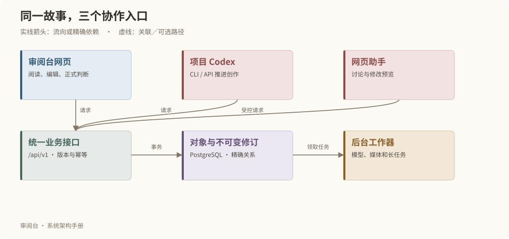

# 阅读导览与系统全景

审阅台把故事创作组织成可以理解、可以判断、可以追溯的对象。人负责选择与判断，AI 提供讨论和草稿建议，软件负责保存版本、核对条件和执行已授权的任务。

## 一张图理解系统

三个入口共享同一套规则。网页提供阅读和审阅上下文；项目中的 Codex 使用 review CLI 或业务接口；网页助手通过受控工具读取上下文。它们最终都访问同一实例，而不是各自维护一份故事。

例如，“修改一场对白”会产生新的正文修订。读者可以继续看到之前采用的版本；只有明确确认后，采用头才改变。软件随后检查哪些对象实际引用了变化的版本，而不是要求重新发布整部剧。

## 按你的问题选择阅读路径

| 读者 | 建议顺序 | 阅读后应能回答 |
| --- | --- | --- |
| 创作者与审阅者 | 本章 → 领域 → 版本与状态 → 人与 AI → 当前实例 | 内容存在哪里？我的判断改变什么？AI 到哪一步必须停下？ |
| 开发者 | 运行架构 → 数据模型 → 分层 → 接口 → 开发质检 | 新能力应放在哪里？怎样复用规则？怎样证明没有误写？ |
| 运行维护者 | 运行架构 → 部署与恢复 → 附录 | 当前运行什么版本？包里有什么？未知结果怎样处理？ |

## 五个最容易混淆的概念

| 概念 | 含义 | 不能据此推断 |
| --- | --- | --- |
| 对象 | 一份内容的永久身份，如某场、某个素材版本 | 显示编号相同就是同一个对象 |
| 修订 | 对象在一次保存后的不可变内容 | 当前草稿已经正式采用 |
| 判断 | 针对精确修订保存的审阅结果 | 意见、建议或聊天自动等于判断 |
| 实际输入 | 某次制作实际引用的精确版本集合 | 设计里提到素材，就锁定了这份媒体 |
| 产物 | 已登记并核验身份的结果 | 文件存在就代表看过、听过或认可过 |

## 手册与实例册的关系

通用主册随核心软件发布，所有故事只读继承。当前项目实例册把相同概念映射到本项目的对象和关系；每次进入或主动刷新重新读取，不把项目内容打包进公开手册。

文档页眉显示实际软件版本。章节末尾给出最近核验日期和实现依据。标为停用或未配置的能力不构成创作授权。

继续阅读：[运行架构](runtime.md)、[领域职责](domains.md)、[当前实例](instance.md)。
