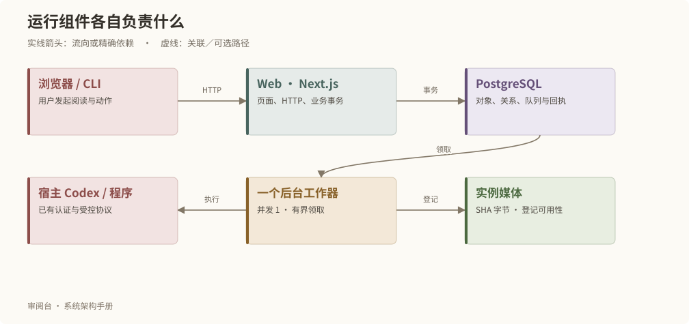
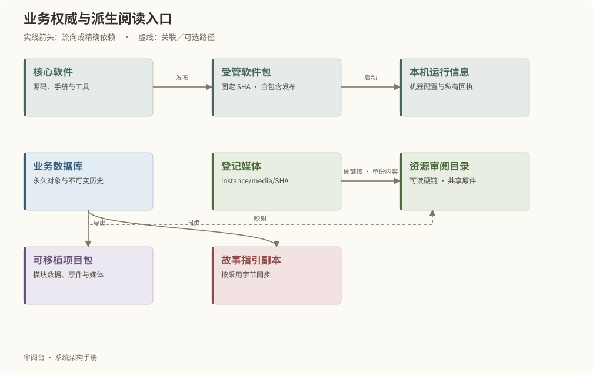

# 运行架构与项目边界

## 运行的最小组成

Web 是 Next.js 的 Node standalone 服务，负责页面、HTTP 和事务入口。一个独立后台工作器领取长任务。PostgreSQL 保存业务对象和执行回执；媒体按 SHA 保存在实例媒体目录。Web 与工作器是原生 Node 进程，数据库通过 Docker 提供，因此 Docker 容器数量不等于系统进程数量。

macOS 由 LaunchAgent 托管，Linux 由 systemd 托管。服务监督器启动 Web 和工作器，并管理有限日志与中断后的任务清理。每个数据库池最多 8 个连接；任务执行并发为 1，排队上限为 100。

## 核心与项目各自拥有什么

| 位置 | 责任 | 更新方式 |
| --- | --- | --- |
| 核心仓库 | 通用源码、Schema、测试、工具、本手册 | 开发、验证、提交 |
| review-software | 项目固定版本的软件包 | 统一部署器按提交更新 |
| instance/instance.json | 永久实例定位 | 创建与受控恢复 |
| PostgreSQL | 对象、修订、关系、判断、执行结果 | 业务事务或工作器 |
| instance/media | 按 SHA 登记的媒体原件 | 受控登记，不原位替换 |
| instance/runtime | 本机配置、凭据引用、运行包和回执 | 本机部署与维护 |
| guidance | 故事规则的受控字节副本 | GUIDANCE 保存、提交、确认后回读 |
| project-data | 可验证、可移植的业务包 | 正式导入导出接口 |
| review-library | 人可浏览的语义目录与链接 | 工作器自动维护的只读投影 |
| .process | 有归属的阶段资源 | 登记、交接、精确清退 |

## 本地与 VPS

本地是创作母本。VPS 发布以一次冻结的本地业务包建立独立演示基线；VPS 的修改不回传本地。两端可以运行相同核心提交，但有不同实例身份、运行期和数据库。

HTTPS 入口可由 Nginx 转发至 Web 的回环地址。证书续期和网络路由属于宿主设施，不属于故事数据包。宿主 Codex 登录也不随项目复制。

## 不依赖过去的运行目录

运行包自包含软件、手册和必要资源；不读取核心开发目录，也不访问封存旧项目备份。导出项目排除机器路径、登录态、队列和执行资格。恢复使用新系统的受管恢复点；取回封存资料必须另行取得用户同意。

相关内容：[部署与恢复](operations.md)、[数据实体](data-model.md)。
