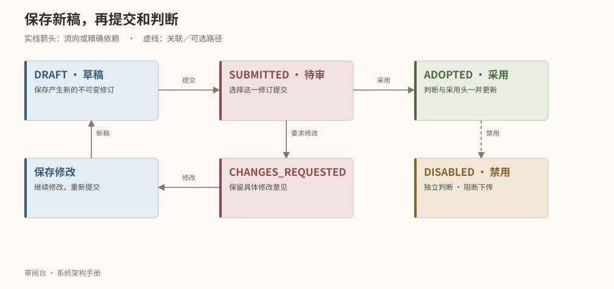
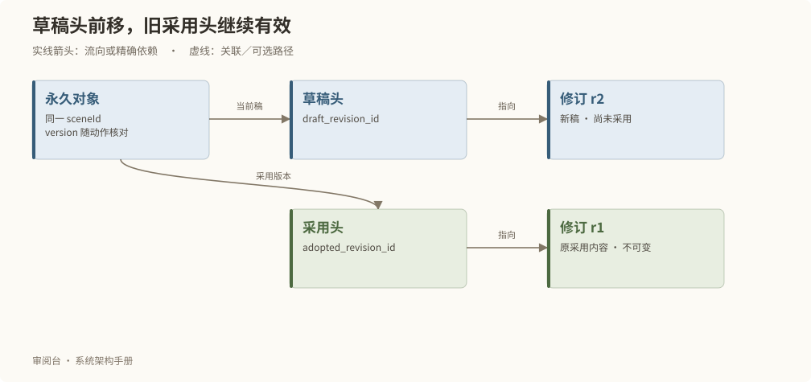
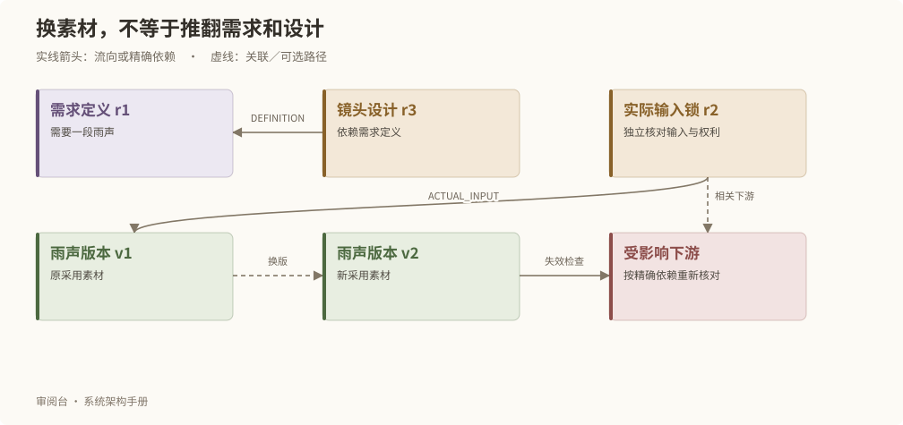

# 状态、版本与变化影响

## 创作对象的状态

| 状态 | 含义 | 后续动作 |
| --- | --- | --- |
| DRAFT | 已保存的草稿 | 继续修改或提交 |
| SUBMITTED | 某一修订等待审阅 | 采用或要求修改 |
| ADOPTED | 已有正式采用结果 | 可以基于它继续创作新稿 |
| CHANGES_REQUESTED | 审阅提出修改要求 | 修改后重新提交 |
| DISABLED | 禁止使用 | 实际下传即时检查禁用条件 |
| ARCHIVED | 历史或归档状态 | 按原身份查询历史 |

状态枚举不等于每一类型都开放所有转换。实际转换由事务命令、对象类型和审阅条件共同校验。正式 Review 的决定是 ADOPT、REQUEST_CHANGES 或 DISABLE。

## 草稿头与采用头可以不同

例如 r1 已采用，保存得到 r2 后，草稿头指向 r2，而采用头继续指向 r1。阅读或制作时必须明确选择哪一头。只有针对 r2 的正式采用才能使采用头前移；历史 r1 保留原字节和判断。

## 一次确认如何生效

确认在一笔事务内核对版本、保存判断、移动采用头并记录精确下游失效。它取消重复同步审批，却不会合并语义不同的判断。

| 事实 | 需要确认的内容 |
| --- | --- |
| 内容采用 | 此修订在业务上被选用 |
| 权利事实 | UNKNOWN、CLEAR、BLOCKED；内部适用说明独立记录 |
| 输入锁定 | 本次实际输入的确切版本、媒体和可用条件 |
| 生成授权 | 本轮明确允许执行的对象和修订 |
| 实际观察 | 人确实听过、看过或检查过的项目 |

内部适用确认不是商业许可或法律审查。看到一个文件也不证明已完成实际观察。

INPUT_LOCK 的采用检查实际引用的素材、Prompt、调用修订及媒体与权利条件；执行请求另绑定本轮明确的 objectId、revisionId 和输出素材族。新产物先登记为候选，不自动采用。

## 精确变化影响

镜头设计依赖“需要一段雨声”的需求定义时，更换雨声音频版本不自动推翻镜头设计。实际输入锁引用旧音频版本时，新采用版本会要求相关下游重新核对。修改另一场的正文，不应无差别废弃本场。

失效记录表示依据发生变化，需要重新判断；它不是静默删除内容，也不是自动把引用换成最新稿。

素材参考和来源绑定会自动形成对应的精确依赖。修改绑定时，服务用新绑定替换其旧依赖，其他职责的依赖继续保留；新旧绑定在同一事务内校验。保存制作设置不等于锁定输入或授权生成。

素材用途判断与原素材采用分开：一张已采用图片可以经过独立用途判断供另一需求使用，原版本、父版本、实际参考附件与权利范围仍各自保留。用途依据绑定需求修订与素材修订；已有判断展示其当时冻结的标准和逐项结论，新标准不静默改写旧判断。

场景中的素材使用位置是独立的关联对象，绑定永久场、需求和双方修订。当前正文或需求变化时，该位置进入待核对列表；历史输入不会按显示场号重新映射。

局部空间视图绑定永久场与空间规格的精确修订。编辑器从已发布版本取得机位与摆位；修改保存为独立草稿，发布时校验原场和区域归属。更换视图不会把旧场次的历史机位换绑到当前显示编号。
