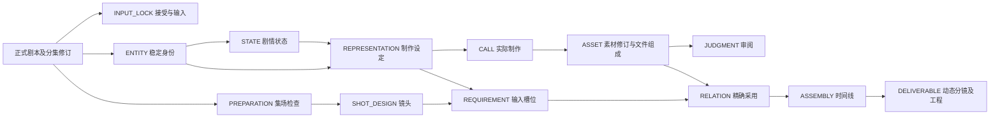

# 制作设定、素材管理与全剧制作

本设计用于把已确认的剧本转成可审阅的制作设定、真实素材和精确镜头输入。系统维护来源、版本、评论、采用及交付关系；抽取、模型调用、声音制作和剪辑在故事工具或外部软件中完成。本文定义完整关系、用户路径和当前分支的最小实现契约。三个制作入口已实现；正式部署、具体作品审阅及验证范围以故事实例的实际记录为准。

## 从剧本到镜头的使用路径

1. 操作者登记用户对具体剧本修订的确认，冻结整版与分集引用。剧本原发布记录即使仍写着待审，也不原地修改；新的输入锁定记录说明接受范围和依据。
2. 按每个剧情场次登记检查结果：哪些角色、空间、道具和歌曲实际呈现、发声或仅被提及，采用什么剧情状态，依据哪些正文块。全剧覆盖可以先完成，实际媒体仅制作当前集所需部分。
3. 在“制作设定”阅读稳定身份、别名、剧情状态和制作选择，点击来源回到准确剧本集场，反查出现在哪些场次和镜头。基准图、声音及设计说明是可修订的表现设定；它们不改变实体身份。
4. 在“全剧制作”按集／场拆镜，列出每镜的动作起止、空间、时长、声音和必要输入槽位。需求可以指向角色基准，也可以直接指向镜头或全项目声音，不强制所有素材属于人物。
5. 制作者在外部工具生成或编辑后，把原件及预览／工程组成存入受管目录，登记实际输入、参数、候选产出。素材页可播放或并排比较具体版本，对图像区域或音视频片段评论，并单独记录审阅结论。
6. 显式选用一个具体素材修订与文件组成，必要时指定裁切或时间段。新增候选只增加候选；审阅通过不会自动采用，采用也不意味着审阅通过。
7. 检查每镜必要槽位，生成可复制到空目录的逐镜输入包。组合记录以帧为单位绑定精确素材与范围，登记可编辑工程和动态分镜输出。技术输入齐备与用户接受完整作品分别展示。

这三页共用既有导航、评论及对象账本，不增加“当前工作”页或独立进度台账。大量初始内容通过批量导入进入；页面提供阅读、单项修订、评论、比较和明确选择，不要求用户逐条填全剧表单。

## 对象、修订和文件各是什么

沿用 `objects`、`revisions`、`dependencies`、`comments` 和配置表，无新业务数据库。对象 ID 标识长期存在的对象；每次修改生成新的不可变修订；依赖、审阅和采用始终指向修订 ID。文件是修订的组成部分，不能用平台链接替代。

| 现有对象类型 | 本次用途 | 明确区分 |
| --- | --- | --- |
| `INPUT_LOCK` | 已接受的制作剧本与制作规格 | 接受依据与剧本原发布状态分开 |
| `ENTITY` | 角色、空间、道具、歌曲的稳定身份；动物和群体为角色子类 | 身份不随服装、伤势或候选图变化 |
| `STATE` | 属于一个实体的必要剧情状态 | 湿歌本与干歌本是状态，湿歌本图第二版仍是同一状态 |
| `REPRESENTATION` | 外观、声线、布局等制作设定及选型说明 | 剧本事实、制作选择、未知分栏；具体基准采用另存 |
| `PREPARATION` | 一个正式集场的实体出场检查、状态及全场覆盖 | 引用剧本场次，不另写一份剧情正文 |
| `SHOT_DESIGN` | 逐镜设计 | 用途、构图、位置、视线、动作起止、声音、时长与承接 |
| `REQUIREMENT` | 一个可判断是否满足的输入槽位 | 计划用途与实际输入、最终采用分开 |
| `ASSET` | 一个素材的稳定 ID，其各修订为候选版本 | 一个版本可含原件、预览、缩略图、工程等多个文件 |
| `CALL` | 实际制作记录，既可为 AI 生成，也可为录音、剪辑等外部操作 | 记录真正提交的输入与结果；计划不能冒充执行 |
| `JUDGMENT` | 针对确切修订的审阅结论或上游变更处理结论 | 审阅、采用、技术验证互不推断 |
| `RELATION` | 明确的素材采用关系 | 绑定使用位置、素材修订、组成及范围；换版须新修订 |
| `ASSEMBLY` | 动态分镜时间线组合 | 精确镜头／素材、时间范围、进出点、轨道与运动说明 |
| `DELIVERABLE` | 实际输出及工程依赖包 | 输出文件与生成它的组合修订关联 |

暂不创建专门歌曲表、生成任务队列或文件数据库。歌曲是 `ENTITY.entity_type=song`，原歌词和段落使用正文引用；演唱方式由状态表达，录音属于 `ASSET`。一份音轨可以服务多个实体或整个项目。



图中箭头表示业务联系；落库的依赖由下游修订指向上游修订。`CALL` 提交时冻结输入，素材产出引用该提交修订；完成记录再引用产出，不回写已提交输入，也不创建修订间循环。

## 数据契约

所有生产载荷采用 `format: production-<类型>-v1`。通用字段为 `title`、`blocks:[{id,text}]`；可审阅的说明必须有稳定正文块。下表列出各类型的业务字段；对象 ID、kind 和 expected_version 在导入记录外层。

| 类型 | 字段及约束 |
| --- | --- |
| input-lock | `screenplay` 精确引用、`episodes` 全部分集引用、`approval:{actor,statement,scope}`、`specification`。不得凭是否存在剧本自动填接受。 |
| entity | `entity_type:character/space/prop/song`、`subtype`、`aliases`、`facts`、`choices`、`unknowns`、`sources`。同一类型中的别名冲突必须显式解决。仅提及对象仍可登记，无自动制作要求。 |
| state | `entity`、`dimensions`、`sources`、`facts`、`choices`、`unknowns`、可选 `previous_states`。多维状态按需求组合，不穷举无用组合。 |
| representation | `entities`、`states`、`sources`、`choices`、`unknowns`。选择的基准通过 adoption 关系查询，不把候选混入设定事实。 |
| preparation | `source` 精确分集／场／全场正文引用、`occurrences:[{entity,states,mode,evidence}]`、`checked:true`、`notes`；mode 为 visual、voice、visual_voice、mention。 |
| shot-design | `episode`、`scene_id`、`source`、`number`、`purpose`、`framing`、`spatial`、`action_start`、`action_end`、`duration_frames`、`fps`、`sound`、`entities`、`states`、`continuity`。预计帧数不冒充实测。 |
| requirement | `scope`、`slot`、`required`、`purpose`、`media_type`、`usage:generation_input/post_audio/editorial`、`entities`、`states`、`specification`。缺项以槽位为单位显示。 |
| asset | `media_type`、`subjects`（可空，支持项目级声音）、`states`、`components`、`production` 实际制作引用、`lineage`。组件包含 `id,role,file,sha256,bytes,mime` 和实际宽高／时长等。必须有原件；工程素材可登记工程文件为原件。 |
| call | `method`、`status:planned/submitted/completed/failed/unknown`、`tool`、`model`、`prompt`、`parameters`、`inputs`、`outputs`、`receipt`、`usage`、`lineage`。completed 必须有实际结果；网络结果不明保留 unknown，不自动重复扣费。 |
| judgment | `target`、`verdict`、`actor`、`reason`、可选 `change:{old,new,action}`；action 为 needs_review、keep、rework、replace。用户接受必须有真实确认依据，不由自检生成。 |
| relation | `relation_type:adoption`、`scope`、`slot`、`asset`、`component_id`、`usage`、`crop` 或 `range`、`reason`。一个 scope＋slot 对应一个稳定采用对象，更新必须带 expected_version。 |
| assembly | `fps`、`width`、`height`、`duration_frames`、`items:[{track,start_frame,duration_frames,asset,component_id,in_seconds,out_seconds,shot,motion}]`；音视频范围不得超出原件，视频轨须覆盖目标镜头。 |
| deliverable | `assembly`、`components`、`dependencies`、`verification`；仅登记真实文件，技术验证不能代替用户第二轮审阅。 |

精确引用统一为 `{object_id,revision_id}`。正文来源可追加 `scene_id,block_ids,quote`；引用的修订须属于该对象，场与正文块须属于该分集，quote 须能在相应原文内找到。不能只填“最新版本”或一个无法定位的 URL。

导入采用有序记录数组：

```json
{
  "format": "production-import-v1",
  "records": [
    {"object_id":"entity-example", "kind":"ENTITY", "expected_version":0,
     "payload":{"format":"production-entity-v1","title":"示例身份","blocks":[{"id":"identity","text":"仅说明契约格式。"}],"entity_type":"prop","subtype":"hand_prop","aliases":[],"facts":[],"choices":[],"unknowns":[],"sources":[]}}
  ]
}
```

该示例仅说明契约，不能导入正式生产来冒充抽取成果。批内后续记录可用 `revision_id:"@entity-example"` 引用前序结果；事务提交前解析成真实修订 ID。外部引用必须提供真实 ID。正向引用、循环、错误 kind、来源不匹配、文件缺失或版本冲突均使整批回滚。数据库与 HTTP／CLI 使用同一校验及提交函数；校验模式运行同一事务后回滚，不留下半批对象。

每个载荷中的精确引用自动成为账本依赖，按字段路径登记 role。不会把裸实体名称当成依赖，也不根据当前头版本补齐缺失修订。

## 文件、原件和恢复

文件位于实例 `export/assets/`，用 SHA-256 内容散列及合法扩展名命名。导入原件采用同目录临时文件写入、校验和原子登记；同哈希重复导入复用，已有文件若内容不符则拒绝覆盖。禁止路径穿越、绝对素材路径和符号链接逃逸。大文件以流式读写和校验处理；浏览器音视频支持 Range 分段读取。

原件、预览、工程是同一素材版本的不同 component。组件各自保存媒体信息与哈希，评论和采用指明 component_id；不能从预览图哈希推断原件未变化。工程文件中的本地依赖采用相对路径，逐镜包和工程包包含所需原件、素材清单、元数据、提示词和制作回执。临时下载地址只留追溯信息。

沿用 bundle Schema 3，新增遍历全部生产修订的组件，将原件和派生物加入既有 manifest；不只导出当前采用。恢复先校验全部文件、生产载荷及精确引用，再写入空实例。若旧版系统未认识生产格式，必须先升级系统；实例通过 `config/instance.json` 锁定所需提交。既有故事、评论、配置与历史图像不迁移、不重建。

媒体探测使用 `ffprobe`，图像和 WAV 可用标准格式头校验；实际像素、时长和音轨信息与登记值吻合才入库。工具不可用或格式不支持时明确拒绝该项，而不以文件扩展名代替检测。

## 审阅、采用与上游变化

共用 `/api/comments` 新增生产媒体时间锚点：

```json
{"type":"time","component_id":"original","asset_file":"HASH.wav","start_seconds":1.2,"end_seconds":3.4}
```

锚点仍由外层 `target_object_id,target_revision_id` 锁定素材修订；范围必须为有限数值且满足 `0 <= start < end <= duration`。生产图像区域复用既有 normalized points 格式，`visual_id` 对应 component_id，`asset_file` 对应精确文件。制作说明、实体、状态、镜头均复用正文块文字评论；整体意见使用明确的 global 锚点。旧 SOURCE、结构与剧本评论继续按原规则校验，不改写历史锚点。

新候选不会影响旧采用。改变实体／状态／设定时，反向查询当前下游修订、镜头、采用和组合，标记需要复核的引用，列出“当时引用的版本／当前新版本／使用位置”。这只是影响范围，不自动宣称必须返工。操作者以独立 judgment 记录保留、返工或替换决定；显式换版形成新的采用与组合修订，历史输入和旧工程仍可恢复。

输入就绪检查依次核对：槽位必需性、明确采用、文件完整性、适配媒体类型／范围、尚未处理的上游变化。页面分别显示“必要输入缺项”“审阅情况”“实际采用”；作品最终接受由另一次用户判断记录，不由缺项为零自动推出。

图像规格可登记 `minimum_width`、`minimum_height`、`minimum_long_edge`，声音可登记 `minimum_sample_rate`、`minimum_channels`。就绪检查使用所选文件的实际探测值。要求 `native_4k:true` 时，还须选择原件并具有该素材版本的 `verification.native_4k_passed:true` 核验记录；该值由操作者根据真实生成参数、回执和原件确认，系统不会仅凭请求中写了“4K”自动设置，也不能用该标记绕过实际像素检查。没有必要槽位时显示尚无就绪依据，不显示已齐备。

## HTTP 与 CLI

CLI 均从系统仓库运行 `python3 -m review_desk --instance /path/to/instance <command>`。导入文件路径相对调用目录解析，媒体包内路径相对包根解析。

| HTTP | CLI | 作用 |
| --- | --- | --- |
| `GET /api/production?kind=&object_id=&revision_id=` | `production-get [--kind K] [--object ID] [--revision SHA]` | 类型、头修订或确切历史详情与使用反查 |
| `GET /api/production/source?object_id=&revision_id=&scene_id=&block_ids=` | `production-source ID SHA [--scene ID] [--block ID ...]` | 读取精确来源正文；历史来源不得静默换成当前正文。HTTP block_ids 为逗号分隔。 |
| `POST /api/production/import` | `production-import file.json [--validate-only]` | 同一事务验证／批量提交，保留乐观版本 |
| `PUT /api/production/files/<name>` | `production-file file` | 流式导入原件，返回组件描述；不会创建采用 |
| `GET /api/production/files/<name>` | 文件可由导出包读取 | 图像／音视频／工程下载，支持 Range |
| `POST /api/production/adopt` | `production-adopt file.json` | 显式选择确切版本及范围；含 expected_version |
| `POST /api/production/judgment` | `production-judge file.json` | 审阅或变更复核结论；含 expected_version |
| `GET /api/production/impact?revision_id=` | `production-impact SHA` | 递归反查当前受影响范围与已有决定 |
| `GET /api/production/readiness?scope=` | `production-ready ID` | 必要输入缺项、引用有效性和待复核项 |
| `GET /api/production/package?scope=` | `production-package ID --output directory` | HTTP 下载精确元数据清单；CLI 将同一清单及其引用的实际文件复制为完整目录包 |
| 既有评论与导出路由 | 既有 `comments/export/restore` | 共用审阅与空实例恢复 |

成功返回具体对象／修订／版本及引用，读取不存在的对象为 404，格式或文件错误为 400，expected_version 不符为 409。失败响应不能泄露凭据。文件导入与业务记录分为两步，失败的未引用文件不自动删除；生产业务导入成功后，输出完整引用清单便于核对。

## 页面最小功能

- **制作设定**：按角色／空间／道具／歌曲浏览和检索；身份详情、别名、事实／选择／未知、并存状态、设定修订、基准采用；下方显示出场、来源及镜头使用。支持编辑说明和导入完整修订，保存前保留当前版本以检测冲突。
- **素材管理**：按媒体与用途筛选真实素材；原件、预览和工程组件选择；并排选择两个确切版本进行比较；图像区域和音视频范围评论；实际制作及输入、候选、审阅、采用分别可读；新候选默认待审，不自动替换。
- **全剧制作**：集／场／镜有序导航、场次实体检查、镜头正文、声音与输入槽位；选择精确素材、查看缺项、下载逐镜包；组合详情显示时间线、工程和动态分镜实际输出，能够反查每段素材。后续镜头视频未生产时不得显示已完成。

页面复用共用评论面板及快捷键，正文采用 textContent／既有安全渲染。窄屏保留层级和可播放控件，不把长 JSON 当主要阅读界面；批量工具保留给制作端使用。

## 图像谱系与媒体制作边界

各实际图像调用记录全部参考的素材修订及 component。纯文字创建是新候选根；以图生图代数取实际生成参考的最深代数加一。本次最小实现的累计上限为两代，故事制作规则另要求优先一代。加入根母版、重命名或再次选为基准不会重置深度。验证器拒绝超限调用记录；故事执行工具在提交生成前应执行同一检查。当前真实候选均为文字生成，尚未执行批量派生。

身份、画面风格和具体修改范围通过提示词及干净母版共同固定。纹理漂移、人物辨识和声音表演属于作品审阅，不能用谱系校验或文件探测声称已经通过。工具／模型不可用、额度不足或用户尚未认可制作基准时，系统可以继续登记需求和缺项，不制造占位成果来满足就绪条件。

## 验证与分阶段交接

自动契约用例覆盖别名、来源、并存状态、一材多用、乐观并发与原子回滚、通过但未采用、显式换版、变更待复核、时间范围及 I2I 代数、原件校验、逐镜包和空库恢复。真实第一集数据另执行批量校验与恢复；浏览器在隔离实例操作三页，并回归故事采编／结构／剧本／制作思路、旧评论和草稿。夹具中的静音和微型图片只用于契约测试，不属于作品素材。完整动态分镜与工程尚未形成，相关视听及工程恢复验收仍待实际交付。

当前实现的限制：页面上传依赖浏览器文件选择器权限；API 上传已验证不等于该交互已验收。时间线校验保证范围合法及画面轨覆盖总时长，但每镜表演、镜序与动作衔接仍须实际回看。HTTP 输入包接口返回清单，CLI 才复制完整文件目录；缺项时两者都拒绝准备就绪包。媒体导出保存全部历史依赖，使用一致的数据库读快照；不会重写现有实例或自动发布到正式服务。

第一轮交接包含完整全剧清单及代表性视觉／声音候选，用户确认精确版本后才批量派生。第二轮交接包含第一集全部真实素材、逐镜包、可播放动态分镜及可编辑工程，实际打开工程、完整回看与听辨，处理意见后才更新实例阶段。正式数据库和服务的发布另按实例授权与最新数据处理；系统仓库不能自动合并到正式主线。

## 外部参考与本项目决定

[Kitsu 的 Breakdown & Casting](https://kitsu.cg-wire.com/guides/production/breakdown-casting/)展示按集、序列或镜头关联资产，并支持批量导入。本项目借鉴“先检查使用位置，再补资产缺项”的阅读路径；精确剧情状态、来源修订和用户定稿门槛是本项目自己的要求，不因采用同类页面就继承 Kitsu 的任务系统。

[ftrack 的 Versions 与 Components](https://help.ftrack-studio.backlight.co/hc/en-us/articles/13129800589591-Introduction-to-Versions)区分可审阅结果版本及其文件组成。本项目据此分别呈现候选版本、原件／预览／工程；使用既有 SQLite 不可变修订和本地校验清单，无需接入 ftrack 存储或重建资产版本平台。上述来源于 2026-09-30 现场读取；它们解释参照，不替代本项目实际验证。
