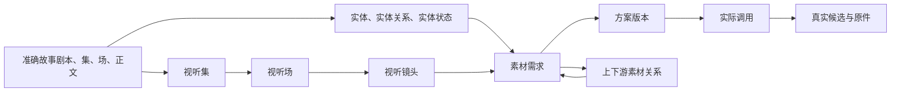

# 生产制作数据与审阅契约

系统提供展示、审阅、评论和数据管理；故事特有的内容编制、模型调用和作品制作在实例工具中完成。生产制作保留视听制作、实体管理、素材管理三个子页。故事剧本同时关联实体与视听两条制作线，准确正文不随制作设计修改。

## 共同来源与对象身份

| 类型 | 用途与准确关系 |
| --- | --- |
| `INPUT_LOCK` | 固定故事剧本与分集修订、真实确认依据和规格 |
| `ENTITY` / `STATE` | 稳定身份与完整实体状态，共同通过 `sources` 回查故事场和正文；状态准确引用所属实体 |
| `RELATION` | 主体关系、出现、适用或明确采用；每一种关系按其语义分别校验 |
| `REPRESENTATION` | 仍有用途的身份、声线或布局说明；不冒充候选或调用 |
| `AV_EPISODE` | 视听集，`story_episode` 固定故事集边界，`scenes` 按顺序引用准确视听场修订 |
| `AV_SCENE` | 视听场，`sources` 可含同集多个故事场的部分正文，`shots` 按顺序引用准确镜头修订 |
| `AV_SHOT` | 视听镜头，包含完整表达、动作起止、时长、实体状态和准确正文范围 |
| `REQUIREMENT` | 一项持续素材需求，`scope` 绑定实体、状态或视听位置；同镜可有多需求 |
| `MATERIAL_RELATION` | 上下游素材生产关系，说明语境、用途、保留与变化约束、必要性和检查方法 |
| `CALL` / `ASSET` | 不可伪造的实际调用与产物，真实原件、组成、来源和输入保持准确 |
| `JUDGMENT` | 设计／方案采纳、结果审阅或变更复核；均以准确修订为目标 |

对象 ID 是稳定身份，修订 ID 是不可变版本。集→场→镜向下固定准确修订；子项更新不会静默改写已有父级编排。需求归属也固定准确位置修订，跨位置复用需明确关系。旧场准备与旧镜头设计类型已经退出导入、读取目录及恢复，不通过改名自动转换。



图中是业务关系；落库依赖由使用方的准确修订指向来源。素材关系中的 `downstream_id` 是稳定需求身份，计划再通过准确 `relation` 引用关系修订，避免创建需求与关系之间的修订循环。执行循环只检查明确选择的路线，描述关系不驱动调用。

## 实体卡审阅与版本采纳

工作方式是 AI 生成或修订，用户直接阅读并评论，AI 按准确版本的意见推进；没有送审步骤，也不在阅读页提供内容编辑入口。采纳定义为认可当前实体基础信息、全部完整状态和逐素材生成方案，允许准备素材生成。按钮在采纳后变为“取消采纳”，新评论和新候选不撤销方案认可；内容或方案修订后需重新认可。

基础信息常驻，状态平铺且默认基础状态。完整状态描述之后按图像、声音和视频分区，列出具体素材名称、用途、模型、参数、提示词、参考及检查要点。各区域只在有历史修订时显示版本选择；历史采纳从“更多”查看，无记录不占位。剧情依据与镜头链接靠近相关内容。

文字、图像及时间段的可评论区域采用统一边线和评论图标；事实、制作选择、待确认、完整描述和方案文字均可圈选。评论区是全局功能，意见绑定实际阅读的对象修订；旧意见加载原文字／原文件，用户草稿继续按版本和锚点隔离。

状态素材必须明确关联到该状态准确修订与文件组成，不能从实体身份推断。图片只在明确缺失的图像需求处占位；缺音频使用紧凑提示条，真实音频直接使用波形播放器，不放人物封面。未匹配当前状态的候选单独保留；旧素材评论独立打开原版本，不混入当前状态。

素材卡使用共用的[方案版本与候选契约](material-versions.md)。当前方案尚无结果时显示真实需求占位，旧结果从版本选择器查看，不重复显示为另一张当前素材卡。跨状态复用或需求退出当前准备范围后，已有原件仍按准确方案与候选展示；素材记录修订号不代替方案版号。图像在固定高度的预览区域完整显示，声音保留原音频和片段评论。

`GET /api/production/entity-review?entity_id=ID` 与 CLI `production-entity-review ID` 返回同一 `entity-workspace-v2` 聚合，包含实体、完整状态、素材、生成需求、精确评论目标、版本及来源。`scope` 锁定 `{entity,states,requirements,dependencies}`；新增候选不进入生成方案的采纳范围。`POST /api/production/entity-decision`／`production-entity-decide FILE` 原子检查范围及乐观版本，记录采纳或取消。执行另检查必要原件的明确采用及准确范围。

完整字段、关系图、采纳／取消并发、生成前检查、输入包和迁移说明见 [实体生成准备契约](generation-preparation.md)。旧 `entity-current-v1` 的准确内容范围未变时，可沿历史决策链取消并重新认可；新决策使用 `entity-content-v1`，仍不作为生成许可。实体、状态、媒体范围改变后不能沿用旧认可；新生成方案继续独立核验完整准备和准确采用。仍有实际用途的 REPRESENTATION 保持准确来源。生产历史重放仅允许空的生产对象集合；普通导入不开放跳过当前校验的开关。

## 数据契约

所有生产载荷采用 `format: production-<类型>-v1`。通用字段为 `title`、`blocks:[{id,text}]`；可审阅的说明必须有稳定正文块。下表列出各类型的业务字段；对象 ID、kind 和 expected_version 在导入记录外层。

| 类型 | 字段及约束 |
| --- | --- |
| input-lock | `screenplay` 精确引用、`episodes` 全部分集引用、`approval:{actor,statement,scope}`、`specification`。不得凭是否存在剧本自动填接受。 |
| entity | `entity_type:character/space/prop/song`、`subtype`、`aliases`、`facts`、`choices`、`unknowns`、`sources`。同一类型中的别名冲突必须显式解决。仅提及对象仍可登记，无自动制作要求。 |
| state | `state_model:complete-v1`、`entity`、`dimensions`、`reference_media:image/audio/none`、`sources`、`facts`、`choices`、`unknowns`。完整快照可跨场复用，不把局部伤势或普通动作独立当作状态。 |
| representation | `entities`、`states`、`sources`、`choices`、`unknowns`。选择的基准通过 adoption 关系查询，不把候选混入设定事实。 |
| av-episode / av-scene | `input_lock`、`sources`、`purpose`、`continuity`、`structure`、`rhythm`；集另有 `story_episode,number,scenes`，场有 `shots`。所有子项使用相同输入锁且故事范围必须包含在父项范围内。 |
| av-shot | `input_lock,sources,purpose,framing,spatial,axis,movement,action_start,action_end,performance,lighting,color,editing,continuity,duration_frames,fps,sound,entities,states`；动作变化用准确 `state_transitions`，画外连续性背景用 `continuity_context`。 |
| requirement | `scope`、`slot`、`required`、`purpose`、`media_type`、`usage:generation_input/post_audio/editorial`、`entities`、`states`、`specification`，可选 `generation` 逐素材生成方案。缺项以槽位为单位显示。 |
| asset | `media_type`、`subjects`（可空，支持项目级声音）、`states`、`components`、`production` 实际制作引用、`lineage`。组件包含 `id,role,file,sha256,bytes,mime` 和实际宽高／时长等。必须有原件；工程素材可登记工程文件为原件。可选 `candidate_requirements` 绑定准确需求，但不表示已按该方案执行或采用。 |
| call | `method`、`status:planned/submitted/completed/failed/unknown`、`tool`、`model`、`prompt`、`parameters`、`inputs`、`outputs`、`receipt`、`usage`、`lineage`。completed 必须有实际结果；网络结果不明保留 unknown，不自动重复扣费。 |
| judgment | `target`、`verdict`、`actor`、`reason`、可选 `change:{old,new,action}`；action 为 needs_review、keep、rework、replace。用户接受必须有真实确认依据，不由自检生成。 |
| relation | `relation_type:adoption`、`scope`、`slot`、`asset`、`component_id`、`usage`、`crop` 或 `range`、`reason`。一个 scope＋slot 对应一个稳定采用对象，更新必须带 expected_version。 |


精确引用统一为 `{object_id,revision_id}`。正文来源可追加 `scene_id,block_ids,quote`；引用的修订须属于该对象，场与正文块须属于该分集，quote 须能在相应原文内找到。不能只填“最新版本”或一个无法定位的 URL。

导入采用有序记录数组：

```json
{
  "format": "production-import-v1",
  "records": [
    {"object_id":"entity-example", "kind":"ENTITY", "expected_version":0,
     "payload":{"format":"production-entity-v1","title":"示例身份","blocks":[{"id":"identity","text":"仅说明契约格式。"}],"entity_type":"prop","subtype":"hand_prop","aliases":[],"facts":[],"choices":[],"unknowns":[],"sources":[]}}
  ]
}
```

该示例仅说明契约，不能导入正式生产来冒充抽取成果。批内后续记录可用 `revision_id:"@entity-example"` 引用前序结果；事务提交前解析成真实修订 ID。外部引用必须提供真实 ID。正向引用、循环、错误 kind、来源不匹配、文件缺失或版本冲突均使整批回滚。数据库与 HTTP／CLI 使用同一校验及提交函数；校验模式运行同一事务后回滚，不留下半批对象。

涉及批量重算时，导入文档可另带 `expected_heads:{object_id:revision_id}`。系统在同一写事务内先核对所有读取依赖的当前修订，再应用各记录的 `expected_version`；任何依赖已改变都返回 409 并整批回滚。预演与提交共用此校验，不能把预演时的旧数据库覆盖回运行实例。

撤回不再适用的计划需求时新增修订，设置 `status:withdrawn`、`required:false` 和非空 `withdrawal_reason`；旧修订、来源与历史采用保留，当前缺项和目录不再纳入该需求。

每个载荷中的精确引用自动成为账本依赖，按字段路径登记 role。不会把裸实体名称当成依赖，也不根据当前头版本补齐缺失修订。

## 完整状态与整体参考

实体回答“是谁／是什么”，状态回答“此时完整地是什么样”。每次实际呈现或发声必须指向所属实体的完整状态；只在被关注的完整形态发生变化时拆分。跨场复用同一形态不会增加状态数，走、坐、回头等普通动作留在镜头说明。人物的衣着、掌心伤和额角伤若同时存在，必须在同一状态中同时说明，执行者无需拼接局部状态。

`complete-v1` 状态的 `dimensions` 是已展开的完整描述，各字段为非空文字。角色包含 `appearance,clothing,injury,health,fatigue,voice,attachments`；空间包含 `layout,dressing,time_light`；道具包含 `structure,condition,contents,placement`；歌曲包含 `lyrics_scope,rendition,performers`。未获剧本或用户支持的细节明确写“未明确／待审”，同时归入 `unknowns` 或 `choices`，不能把未提及写成确定正常或健康。整体描述完整不等于造型已经批准。

集场和镜头采用 `state_model:complete-v1`。镜头的 `states` 对每个实体按时间排序，同一实体发生状态变化时，`state_transitions:[{from,to,action,source}]` 必须逐对说明动作及准确依据；来源正文必须在该镜头引用范围内。不得跨实体、遗漏转换或用局部状态冒充完整状态。`mention` 仍可关联已知事实状态，但不产生媒体生产义务；仅提及的完整状态使用 `reference_media:none`。

通常每个需要呈现的状态采用一份整体参考，必要时增加角度、细节或声音素材。`reference_media` 指定整体参考所需的图像或音频，不强制不可见声音拥有立绘。状态下固定 `overall` 需求槽位，`scope` 和 `states` 都绑定该状态的确切修订，`specification.reference_role=overall`；可选或必需的补充槽位由实际用途命名，角色为 `detail`。整体参考未选时，已有细节素材不能使该状态就绪。素材数量不改变状态数量。

素材修订通过 `state_coverage:[{state,role,component_id,detail,crop?,range?}]` 说明覆盖内容；`state` 是完整状态的精确引用，须同时出现在 `states` 中。`role` 为 `overall` 或 `detail`，`detail` 说明整体现状或具体局部。所指组成必须属于该素材修订，裁切／时间范围遵守既有媒体约束。同一版本可覆盖多个状态，也可为同一状态提供多个组成。采用继续复用 `RELATION`；只有对应修订、组成和覆盖范围均匹配时才满足要求，不能以另一状态修订或细节标签替代。缺省范围代表整个组成。整体采用必须与登记覆盖范围一致，避免局部裁切冒充全貌；细节及普通镜头槽位允许在登记范围内继续裁切。

读取就绪状态仍使用原 `/api/production/readiness` 和 `production-ready`，返回新增 `state_coverage:{checked_count,states,issues}`：实际检查的实体使用次数、去重后的准确状态引用、问题清单。问题逐实体／使用位置报告缺失、旧局部状态、错误归属、无转换及缺少整体参考需求。就绪检查同时纳入被引用完整状态的整体参考槽位；这些错误与必要素材缺项一样阻止逐镜包输出。`STATE` 自身也可检查整体／补充参考。通过但未采用的候选仍显示未采用，新增候选不改变旧采用。

正常状态修订与素材方案建版均保留准确历史。一次性旧体系退役独立于日常创作，见[切换与恢复](version-consolidation.md)；不能靠重放旧场准备恢复已退役内容。

## 文件、原件和恢复

文件位于实例 `export/assets/`，用 SHA-256 内容散列及合法扩展名命名。导入原件采用同目录临时文件写入、校验和原子登记；同哈希重复导入复用，已有文件若内容不符则拒绝覆盖。禁止路径穿越、绝对素材路径和符号链接逃逸。大文件以流式读写和校验处理；浏览器音视频支持 Range 分段读取。

原件、预览、工程是同一候选的不同 component。组件各自保存媒体信息与哈希，评论和采用指明 component_id；不能从预览图哈希推断原件未变化。工程文件中的本地依赖采用相对路径，逐镜包和工程包包含所需原件、素材清单、元数据、提示词和制作回执。临时下载地址只留追溯信息。

当前完整 bundle 使用 Schema 9，包含视听对象、素材关系、准确版本与候选、评论及最小清理凭据。遍历全部保留修订的文件组成并校验原件；退役生产类型在导入与恢复时均拒绝。故事域的兼容读取不意味着可恢复旧制作体系。实例还通过策略绑定准确清理基线。

导出先校验数据、布局和全部原件哈希，再暂存元数据文件，最后替换清单；不复制或替换媒体目录。校验、暂存或文件替换发生可捕获错误时，保留上一份完整导出的内容；首次导出失败则移除本次已发布的部分元数据。共享目录的导出和发布仍须按序执行，不支持多个写入者同时发布同一目录。

恢复要求 Schema 1 的 `materials.json`、`comments.json`，以及 后续 Schema 另需的 `objects.json`、`configurations.json` 全部列入哈希清单；不能读取漏列的核心文件。可选关系布局先暂存，文件发布与数据库写入共同处理失败：布局不能写入或数据库提交失败时，回滚本次数据并恢复原布局，排除错误后可对同一空实例重试。评论、事件、精确修订、轮次和原件的校验规则保持不变。

上述回滚处理正常抛出的错误，不保证进程被强杀或断电时 SQLite 与多个文件同时完成。此类中断后先核验清单与数据库，再决定恢复；若回滚本身也因文件系统错误失败，命令会报出保留的 `.bundle-*` 恢复目录，不能把该次操作记为成功或直接删除这些文件。针对失败保留与旧 Schema 的隔离测试见 [test_bundle_integrity.py](../tests/test_bundle_integrity.py)。

媒体探测使用 `ffprobe`，图像和 WAV 可用标准格式头校验；实际像素、时长和音轨信息与登记值吻合才入库。工具不可用或格式不支持时明确拒绝该项，而不以文件扩展名代替检测。

## 审阅、采用与上游变化

共用 `/api/comments` 新增生产媒体时间锚点：

```json
{"type":"time","component_id":"original","asset_file":"HASH.wav","start_seconds":1.2,"end_seconds":3.4}
```

锚点仍由外层 `target_object_id,target_revision_id` 锁定素材修订；范围必须为有限数值且满足 `0 <= start < end <= duration`。生产图像区域复用既有 normalized points 格式，`visual_id` 对应 component_id，`asset_file` 对应精确文件。制作说明、实体、状态、镜头均复用正文块文字评论；整体意见使用明确的 global 锚点。旧 SOURCE、结构与剧本评论继续按原规则校验，不改写历史锚点。

制作记录的 `facts`（剧本事实）、`choices`（制作选择）和 `unknowns`（待确认信息）也支持同一文字评论接口。前后端按相同规则，在原有 `blocks` 后生成只读的评论文本块：使用 `@review/字段/原数组下标` 作为块 ID；若原正文已使用该前缀，则增加前导 `@`，直至不冲突。空项、已包含在正文中的文字和重复说明不重复展示；索引保留原数组位置。评论仍锁定不可变修订，文字偏移按 Unicode 字符计算，修改字段不会改写旧锚点。该投影不写入对象载荷，无需数据库迁移；包含这类评论的导出必须由支持该规则的系统恢复，旧正文和图像锚点保持原样。

新候选不会影响旧采用。改变实体／状态／设定时，反向查询当前下游修订、镜头和采用，标记需要复核的引用，列出“当时引用的版本／当前新版本／使用位置”。这只是影响范围，不自动宣称必须返工。操作者以 judgment 记录保留、返工或替换决定；同一准确使用位置与同一对上游旧／新修订保留一个可修订结论，显式换版形成新的采用修订，保留的历史输入和原件仍可恢复。

保存变更处理时锁定本次表单，保留取消和页面导航。结论只针对提交时的准确上下游修订；成功后更新原来的缺项检查并保留集场范围与分页，已切换到其他范围时不重载新页面。服务已保存而检查刷新失败时，页面明确区分这两种结果，不能再次提交已保存的表单。网络中断后先按本次请求 ID 核对完整载荷与 expected_version + 1 修订；确认一致才显示保存成功，尚无法确认则保留原请求，由用户原样重试核对。修改正文或处理选项不会被旧请求的成功代替，也不自动提高版本或覆盖其他结论。请求恢复限于仍打开的表单，刷新或关闭页面后不承诺恢复未确认请求。


同一结论的业务范围由准确 `target`、`change.old`、`change.new` 的对象与修订共同决定，`scope` 未填与 `target` 等价，`state_title_only` 单独处理。已保存的结论沿原对象 ID 提交新修订，必须传读取时的 `expected_version`；旧窗口收到 409，输入保留，不能自动提高版本。首次并发创建、批量导入和 CLI 也在同一写事务内核对唯一性。已放行的变更仍列在原“准确版本变更”详情内，可修改为返工／替换；原 keep 修订保留，且不会继续豁免新结论。

旧导出可能含多个不同 ID 的同范围结论。系统保留每份原记录和原样填写的复核者字段，不按时间或复核者推断赢家；多个结论即使 action 相同也暂不放行。既有表单逐项呈现它们，用户明确保存一个统一结论时，新 judgment 的 `change.resolves` 必须准确引用全部旧当前头，格式为 `[{object_id, revision_id}, ...]`。服务端在同一事务核对同范围、完整性及旧头未变；遗漏、借用别的范围或过期引用均不能生效。统一结论以后只修订自身且保留这组引用，其他旧 ID 不能另行更新来绕过它。历史恢复保留原多记录，读取时应用上述规则，不改写历史或删除旧意见。

`readiness` 的 `pending_changes` 仍只列尚未放行的准确变化，原缺项语义不变；只读 `change_reviews` 同时列已放行与待处理变化，包含当前 `decision`、原 `decisions` 和是否存在未归并多结论的 `conflict`，供原详情读取和修订，不写入业务载荷或导出。普通位置明确记录的返工／替换不能被独立的仅改名豁免压过；没有位置结论时，原纯状态改名规则继续有效。

`STATE` 的中文名称为“实体状态”，标题建议为“所属实体完整名称·状态说明”，避免与实体使用不同简称。改名仍创建不可变新修订，旧引用不自动换版。核对影响后，如果同一状态的两个版本只有 `title` 不同，可经既有导入／审阅接口登记命名复核：`target` 为准确新状态，`verdict=impact_resolved`，`change={old,new,action:keep,scope:state_title_only}`，并填写实际操作者和理由。系统逐项验证除标题外的载荷完全相同；该明确结论适用于所有引用旧版本的位置，保留旧输入、评论和采用。未登记结论、修改其他字段或出现后续新修订时，仍提示待复核。普通复核继续只针对 `target`；不将改名自动判断为无影响或视为用户接受内容。

输入就绪检查依次核对：槽位必需性、明确采用、文件完整性、适配媒体类型／范围、尚未处理的上游变化。页面分别显示“必要输入缺项”“审阅情况”“实际采用”；作品最终接受由另一次用户判断记录，不由缺项为零自动推出。

`readiness` 的 `inputs_ready`、`required_count`、`missing_count` 继续只表达必要输入与完整状态覆盖。新增 `package_available` 表示本次检查能否输出现有完整输入包，`package_issue` 在文件失败时给出准确素材对象／修订、组成、文件和原因，成功或必要输入尚缺时为 null。这两个派生字段不入库、不改 schema，旧调用方可继续使用原字段。

下载能力与 `package_manifest` 共用准确依赖收集和全部文件校验，不仅检查当前采用的组成：已采用可选原件、实际调用引用的历史输入及包内其他组成均保留，缺失或损坏时不能静默省略。未采用可选需求以及原契约允许的可选规格不足仍可打包；不把可选项转成必需。页面沿用原下载按钮和一处具体原因，已在当前采用行表达的同一文件错误不重复显示，历史依赖可沿准确原件引用核对。单次检查只复用组件内容及文件身份、大小、修改时间均未变化的校验结果，不跨请求缓存；实际 HTTP 下载和 CLI 打包重新检查，页面先前显示可用不代替执行时校验。

图像规格可登记 `minimum_width`、`minimum_height`、`minimum_long_edge`，声音可登记 `minimum_sample_rate`、`minimum_channels`。就绪检查使用所选文件的实际探测值。要求 `native_4k:true` 时，还须选择原件并具有该素材版本的 `verification.native_4k_passed:true` 核验记录；该值由操作者根据真实生成参数、回执和原件确认，系统不会仅凭请求中写了“4K”自动设置，也不能用该标记绕过实际像素检查。没有必要槽位时显示尚无就绪依据，不显示已齐备。

## HTTP 与 CLI

CLI 均从系统仓库运行 `python3 -m review_desk --instance /path/to/instance <command>`。导入文件路径相对调用目录解析，媒体包内路径相对包根解析。

| HTTP | CLI | 作用 |
| --- | --- | --- |
| `GET /api/production/entity-review?entity_id=&revision_id=` | `production-entity-review ID [--revision SHA]` | 当前实体／状态／素材、准确评论目标、出场、采纳及历史 |
| `GET /api/production?kind=&object_id=&revision_id=` | `production-get [--kind K] [--object ID] [--revision SHA]` | 类型、头修订或确切历史详情与使用反查 |
| `GET /api/production/source?object_id=&revision_id=&scene_id=&block_ids=` | `production-source ID SHA [--scene ID] [--block ID ...]` | 读取精确来源正文；历史来源不得静默换成当前正文。HTTP block_ids 为逗号分隔。 |
| `POST /api/production/import` | `production-import file.json [--validate-only]` | 同一事务验证／批量提交，保留乐观版本 |
| `PUT /api/production/files/<name>` | `production-file file` | 流式导入原件，返回组件描述；不会创建采用 |
| `GET /api/production/files/<name>` | 文件可由导出包读取 | 图像／音视频／工程下载，支持 Range |
| `POST /api/production/adopt` | `production-adopt file.json` | 显式选择确切版本及范围；含 expected_version |
| `POST /api/production/judgment` | `production-judge file.json` | 审阅或变更复核结论；含 expected_version |
| `GET /api/production/impact?revision_id=` | `production-impact SHA` | 递归反查当前受影响范围与已有决定 |
| `GET /api/production/readiness?scope=` | `production-ready ID` | 必要输入缺项、引用有效性和待复核项 |
| `GET /api/production/package?scope=` | `production-package ID --output directory` | HTTP 下载精确元数据清单；CLI 将同一清单及其引用的实际文件复制为完整目录包 |
| 既有评论与导出路由 | 既有 `comments/export/restore` | 共用审阅与空实例恢复 |

成功返回具体对象／修订／版本及引用，读取不存在的对象为 404，格式或文件错误为 400，expected_version 不符为 409。失败响应不能泄露凭据。文件导入与业务记录分为两步，失败的未引用文件不自动删除；生产业务导入成功后，输出完整引用清单便于核对。

## 页面最小功能

- **实体管理**：按角色／空间／道具／歌曲浏览和检索；身份详情、别名、事实／选择／未知、并存状态、设定修订、基准采用；下方显示出场、来源及镜头使用。用户在页内直接评论和采纳当前版本，Codex 根据意见通过工具修订。
- **素材管理**：按媒体与用途筛选真实素材；原件、预览和工程组件选择；并排选择两个确切版本进行比较；图像区域和音视频范围评论；实际制作及输入、候选、审阅、采用分别可读；新候选默认待审，不自动替换。
- **视听制作**：集／场／镜有序导航、场次实体检查、镜头正文、声音与输入槽位；选择精确素材、查看缺项、下载逐镜包。后续镜头视频未生产时不得显示已完成。

制作设定以实体为浏览入口：筛选区只平铺全部实体、角色、场景、道具、歌曲及各自的实体数量，不将实体状态或制作设定列为同级分类。目录每个实体只出现一次，标出当前完整状态数；历史局部状态不计入此数。实体卡上方默认展示身份、别名、基础说明、剧本事实、制作选择及待确认信息；下方平铺完整状态，切换状态不会替换上方信息。打开实体默认选择按剧情来源排序的首个完整状态，标为“基础状态”；这是浏览默认值，不新建状态或修改剧情数据。来源、出场与历史引用可展开核对。实体与状态分别保留版本和评论锚点，选择正文或相应审阅入口后，评论绑定该层的准确修订，两个层级的草稿分别保留；查看实体历史时，已选状态仍显示在下方。状态与设定继续是可独立引用的底层对象，不能将它们的数据并入实体正文或改写历史引用。来自镜头、素材或旧页面地址的准确状态链接仍可打开；新增的 `production_entity` 页面参数只保存浏览上下文，不改变任何引用。

分类按钮的数量保留搜索条件后计算，同一实体及其历史修订不重复计数；搜索实体、别名、状态或设定内容均可找到所属实体。零数量选项保留，再次点击已选分类可取消限制，“清除筛选”同时恢复搜索与分类。筛选只更新目录，保留正在阅读的详情与评论草稿；点击实体或内部状态才切换阅读对象。按钮支持键盘操作和窄屏换行。

一项制作设定可以出现在多个相关实体内，按关联实体及状态的所属实体去重。没有关联实体或状态的项目共用设定在独立区域展示，不强制挂到某个角色，也不计入实体筛选数量。历史设定读取其精确状态依赖以定位所属实体，不以状态的新修订替换旧依据。实体内导航不改变底层身份或评论锚点；完整状态的数据迁移遵循前述契约，旧局部状态仍可按准确历史链接读取。前端导航回归使用 `node --test tests/production_navigation.test.cjs`，覆盖多实体关联、项目共用设定、历史依赖、默认基础状态、独立评论目标及异步切换；实际页面与搜索交互仍须在隔离实例操作验收。

`INPUT_LOCK` 保留在底层账本和 HTTP／CLI 中，继续承载精确引用、历史、确认及规格记录，不进入实体管理列表。视听制作按所选集场镜读取设计与视频方案，准确链接保留其原修订；不加载全剧素材缺项。共用记录详情仍可检查自身需求，底层 `production-ready` 与逐镜输入包契约保持。旧镜头页链接进入同一准确位置；旧组合页链接明确不可用。

页面复用共用评论面板及快捷键，正文采用 textContent／既有安全渲染。窄屏保留层级和可播放控件，不把长 JSON 当主要阅读界面；批量工具保留给制作端使用。

## 图像谱系与媒体制作边界

各实际图像调用记录全部参考的素材修订及 component。纯文字创建是新候选根；以图生图代数取实际生成参考的最深代数加一。本次最小实现的累计上限为两代，故事制作规则另要求优先一代。加入根母版、重命名或再次选为基准不会重置深度。验证器拒绝超限调用记录；故事执行工具在提交生成前应执行同一检查。具体作品的调用、谱系与原件以实例真实记录为准。

身份、画面风格和具体修改范围通过提示词及干净母版共同固定。纹理漂移、人物辨识和声音表演属于作品审阅，不能用谱系校验或文件探测声称已经通过。工具／模型不可用、额度不足或用户尚未认可制作基准时，系统可以继续登记需求和缺项，不制造占位成果来满足就绪条件。

## 验证与分阶段交接

自动契约用例覆盖别名、来源、并存状态、一材多用、乐观并发与原子回滚、通过但未采用、显式换版、变更待复核、时间范围及 I2I 代数、原件校验、逐镜包和空库恢复。真实第一集数据另执行批量校验与恢复；浏览器在隔离实例操作三页，并回归故事采编／结构／剧本／制作思路、旧评论和草稿。夹具中的静音和微型图片只用于契约测试，不属于作品素材。镜头视频和后续组合工程须在具体制作任务中实际交付与验收。

当前实现的限制：页面上传依赖浏览器文件选择器权限；API 上传已验证不等于该交互已验收。每镜表演、镜序与动作衔接须在具体制作任务中实际回看。HTTP 输入包接口返回清单，CLI 才复制完整文件目录；缺项时两者都拒绝准备就绪包。媒体导出保存全部历史依赖，使用一致的数据库读快照；不会重写现有实例或自动发布到正式服务。

本系统当前能力终点是镜头多个候选的组织、登记、预览与审阅。剪辑时间线、组合成片及成片导出由后续独立任务处理，不能据当前方案数量宣称已经完成。

## 外部参考与本项目决定

[Kitsu 的 Breakdown & Casting](https://kitsu.cg-wire.com/guides/production/breakdown-casting/)展示按集、序列或镜头关联资产，并支持批量导入。本项目借鉴“先检查使用位置，再补资产缺项”的阅读路径；精确实体状态、来源修订和用户定稿门槛是本项目自己的要求，不因采用同类页面就继承 Kitsu 的任务系统。

[ftrack 的 Versions 与 Components](https://help.ftrack-studio.backlight.co/hc/en-us/articles/13129800589591-Introduction-to-Versions)区分可审阅结果版本及其文件组成。本项目据此分别呈现候选版本、原件／预览／工程；使用既有 SQLite 不可变修订和本地校验清单，无需接入 ftrack 存储或重建资产版本平台。上述来源于 2026-09-30 现场读取；它们解释参照，不替代本项目实际验证。

## 描述型声音状态与显式需求清理

归并重复实体或完整状态时，通过新修订标记 `status: "withdrawn"`，并保存归并依据与准确目标；不删除旧身份、原件、调用、认可或评论。撤回项不再进入当前实体列表、实体完整状态清单、生成范围及当前覆盖缺项检查，历史准确链接仍可读取。被撤回的整体需求可设 `required: false`，但必须保留原状态、归属、媒体类型与整体槽位的准确关联；撤回需求不能用于新的生成许可。

已撤回的旧实体审阅记录仍验证其准确历史状态和素材范围，不再要求它包含后来新增的当前状态。故事端恢复按历史依赖回放，不将归并后的新对象头替换旧引用，也不通过重新抽取复活已撤回的重复项。

完整状态可声明 `reference_mode: "description"`，表示仍会实际呈现／发声，但通过完整描述随镜头生成，无须为它单独提供整体原件。默认 `material` 保持原行为。描述型状态必须有非空 `production_description`，仍校验实体归属、准确来源、转换与镜头使用；不能与只表示提及的 `reference_media: "none"` 混用。它不免除镜头其余素材，也不代表视听产出已完成。具体音色、旋律及模型编排由故事实例负责。

用户明确要求物理删除尚未被使用的计划时，可在既有 `POST /api/production/import` 或 CLI `production-import FILE` 的批次中增加 `remove_unreferenced_requirements`，值为准确 `{object_id, revision_id}` 数组。`records` 可为空。该操作仅允许 REQUIREMENT：核对当前版本，拒绝存在任何历史评论、保留对象的历史依赖或非需求身份的删除；校验与删除全部修订、依赖及同批新修订在一个事务完成，任何失败完整回滚。`expected_heads` 与 `--validate-only` 仍有效。返回 `removed` 为实际删除对象 ID，不提供页面删除按钮，不将撤回与物理删除混同。删除前必须另存完整可恢复导出；实际媒体及已执行调用应保留。
